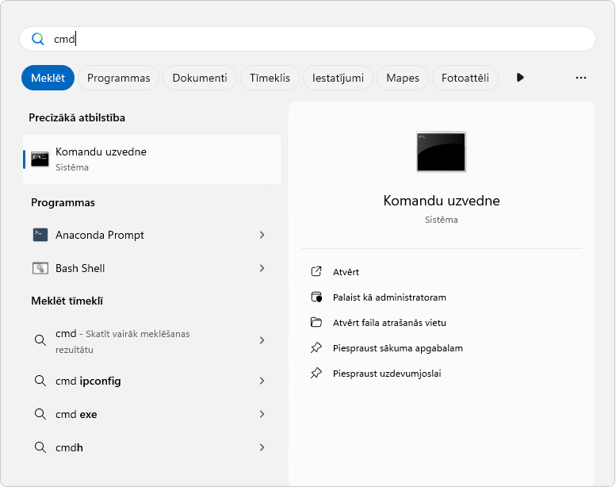
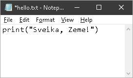
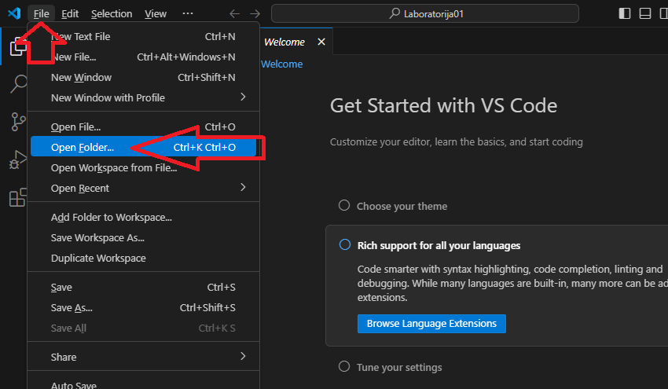
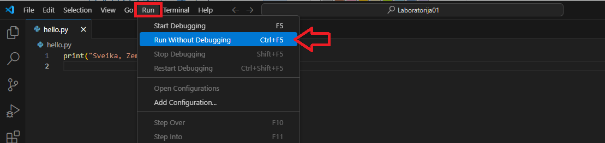

# Ievads Python, pirmās programmas

Pirms ķersimies pie tehniskajām detaļām, veltīsim mirkli, lai pārrunātu, ko jūs drīz apgūsiet un kāpēc tas ir svarīgi. Ja lasāt šo tekstu, jūs (visticamāk) esat pabeiguši uzstādīšanas procesu, kas nozīmē, ka esat gatavi sākt rakstīt reālu Python kodu. Tas ir aizraujošs sasniegums!

Šajā nodaļā mēs veidosim jūsu pamata izpratni par Python kā programmēšanas valodu. Vēl pagaidām mēs daudz koda nerakstīsim... tā vietā mēs izpētīsim "vispārīgus" jautājumus: Kas ir Python? No kurienes tas cēlies? Kāpēc tas ir kļuvis tik populārs? Un, kas ir vissvarīgāk, kāpēc tas ir lieliska izvēle kā jūsu pirmā (vai nākamā) programmēšanas valoda?

Uztveriet šo nodaļu kā ievada nodarbību. Tradicionālā klasē pasniedzējs pirmo nodarbību veltītu šo jēdzienu izskaidrošanai, atbildētu uz jautājumiem un palīdzētu jums izprast kopainu, pirms ķerties pie sintakses. Tā kā jūs mācāties savā tempā, mēs esam apkopojuši visu šo konteksta informāciju šeit. Veltiet šim materiālam pietiekami daudz laika -- izpratne par to, "kāpēc" Python ir tāds, kāds tas ir, padarīs "kā" apguvi daudz jēgpilnāku.

> [!NOTE]
> Mācību padoms: Varbūt tev jau tagad gribas sākt programmēt, un tas ir lieliski! Taču, ja tu programmēšanu apgūsti pirmo reizi, nepadodies kārdinājumam izlaist šo nodaļu. Šeit iegūtā konteksta izpratne palīdzēs saprast visu pārējo. Uztver to kā šaha noteikumu apguvi pirms pirmās spēles -- tu, protams, vari sākt spēlēt uzreiz, taču, ja vispirms izpratīsi pamatus, ceļš būs vieglāks.

## 🔍 Iepazīsti Python: *Valoda, kas mainīja programmēšanu*

Python izveidoja *Gvido van Rosums* (Guido van Rossum), kuru kopiena bieži sirsnīgi dēvēja par Python ["labvēlīgo diktatoru uz mūžu"](https://realpython.com/ref/glossary/bdfl/), un pirmā valodas versija tika publicēta `1991`. gadā. Tomēr Python nekļuva veiksmīgs vienā dienā. Bija vajadzīgi daudzi izstrādes un kopienas izaugsmes gadi, lai tas kļūtu par tādu valodu, kādu pazīstam šodien.

Tagad, vairāk nekā trīsdesmit gadus vēlāk, Python regulāri ierindojas starp trim populārākajām programmēšanas valodām pasaulē. Bet kāpēc? Kas Python padara īpašu, ja iespējams izvēlēties kādu no simtiem programmēšanas valodu?

Atbilde meklējama Python izstrādes pamatfilozofijā: **koda lasāmībā un vienkāršībā**. Radot Python, Gvido iztēlojās valodu, kuru būtu gandrīz tikpat viegli lasīt kā angļu valodu un kurā koda struktūra būtu saprotama jau no pirmā acu uzmetiena. Tas var nešķist revolucionāri, taču tolaik vairumā programmēšanas valodu pat vienkāršas programmas uzrakstīšanai bija vajadzīgi daudzi grūti saprotami simboli, sarežģīta sintakse un dziļas tehniskās zināšanas.

Python to mainīja. Lūk, viens un tas pats uzdevums divās dažādās valodās.

**Java (a more verbose language):**

```java
public class HelloWorld {
    public static void main(String[] args) {
        System.out.println("Hello, World!");
    }
}
```

**Python:**

```python
print("Hello, World!")
```

Vai redzi atšķirību? Python novērš lieko sarežģītību un ļauj koncentrēties uz to, ko patiesībā vēlies paveikt. Šī vienkāršības un lasāmības filozofija caurvij visu Python — no sintakses līdz pat kopienas kultūrai.

### Ko īsti nozīmē "augsta līmeņa interpretēta valoda"?

Python bieži raksturo kā *augsta līmeņa interpretētu valodu*, kas atbalsta vairākas programmēšanas paradigmas. Aplūkosim, ko tas nozīmē praksē, jo šīs īpašības tieši ietekmē darbu ar Python:

- augsta līmeņa valoda;
- interpretēta valoda;
- vairāku paradigmu valoda.

#### **Augsta līmeņa valoda:** *Python parūpējas par sarežģīto*

Iedomājies, ka būvē māju. Izmantojot *"zema līmeņa"* pieeju, tev būtu jāpārzina betona ķīmija, tērauda siju metalurģija un slodzes sadalījuma fizika. Izmantojot *"augsta līmeņa"* pieeju, tu strādātu ar gataviem materiāliem un celtniekiem paredzētiem instrumentiem.

Python ir *"augsta līmeņa"* valoda tādā pašā nozīmē. Tā paslēpj sarežģītās tehniskās detaļas par datora faktisko darbību:

- nav manuāli jāpiešķir un jāatbrīvo datora atmiņa;
- nav jāsaprot binārais kods vai procesora instrukcijas;
- nav jāpārvalda veids, kādā dati tiek glabāti atmiņā.

Tā vietā Python piedāvā intuitīvus rīkus un jēdzienus, kas atbilst tam, kā cilvēki dabiski domā par problēmām. Vēlies saglabāt vārdu sarakstu? Vienkārši izveido sarakstu. Kaut kas jāatkārto desmit reizes? Uzraksti vienkāršu ciklu. Par visu pamatā esošo sarežģītību parūpējas Python.

*Kāpēc tas tev ir svarīgi?* Tas ļauj daudz ātrāk sākt produktīvi strādāt. Kamēr `C++` apguvējs var pavadīt nedēļas, mācoties pārvaldīt atmiņu, pirms spēj izveidot ko noderīgu, tu ar Python vari sākt risināt reālas problēmas jau dažu stundu vai dienu laikā.

#### **Interpretēta valoda:** *Izpildi kodu uzreiz — nav jāgaida*

Kad raksti Python kodu, Python interpretators to nolasa un izpilda rindu pēc rindas reāllaikā. Tas būtiski atšķiras no "kompilētām" valodām, piemēram, C++ vai Java.

Darba procesi atšķiras šādi.

**Darba process kompilētā valodā:**

1. Uzraksti kodu.
2. Palaid kompilatoru, lai visu programmu pārtulkotu mašīnkodā.
3. Ja ir kļūdas, atgriezies pie 1. soļa.
4. Ja kompilācija ir veiksmīga, palaid nokompilēto programmu.
5. Ja atrodi kļūdu vai vēlies kaut ko mainīt, atgriezies pie 1. soļa.

**Darba process interpretētā valodā (Python):**

1. Uzraksti kodu.
2. Uzreiz to palaid.
3. Tūlīt apskati rezultātu.
4. Veic izmaiņas un palaid kodu vēlreiz.

Mācoties tas ir ārkārtīgi vērtīgi. Vari eksperimentēt, pārbaudīt idejas un nekavējoties saņemt atgriezenisko saiti. Pieļāvi kļūdu? Nekas — izlabo to un pēc dažām sekundēm mēģini vēlreiz. Šis īsais atgriezeniskās saites cikls paātrina mācīšanos un programmēšanu vairāk līdzinās sarunai ar datoru, nevis formālam, ilgstošam procesam.

> **Piezīme par praktisko lietojumu:** Iespējams, dzirdēsi, ka interpretētās valodas ir *"lēnākas"* par kompilētajām valodām, un tajā ir daļa patiesības. Tomēr lielākajai daļai lietojumu, tostarp **profesionālai datu zinātnei**, **tīmekļa izstrādei** un **automatizācijai**, Python ir pietiekami ātrs. Tādi uzņēmumi un organizācijas kā Google, Netflix un NASA plaši izmanto Python savās produkcijas sistēmās (vairāk vari lasīt [šeit](https://jaydevs.com/top-companies-that-use-python/)). Ātrums reti ir galvenais ierobežojums; izstrādātāju produktivitāte un koda uzturēšanas ērtums parasti ir daudz svarīgāki.

#### **Vairākas programmēšanas paradigmas:** elastība domāšanā

Python atbalsta dažādas programmēšanas *"paradigmas"* jeb stilus. Paradigmas vari uztvert kā atšķirīgus koda organizēšanas un problēmu risināšanas veidus. Iesācējam nav jāapgūst tie visi — tu dabiski izvēlēsies savai problēmai piemērotāko. Tomēr ir noderīgi zināt, ka tie pastāv.

**1. Procedurālā programmēšana:** kods tiek rakstīts kā secīgu instrukciju virkne — līdzīgi kā recepte. Bieži tas ir intuitīvākais veids, ar ko sākt.

```python
# 1. solis: sagatavo sastāvdaļas
olas = 3
milti = "2 glāzes"

# 2. solis: sajauc tās
masa = sajaukt(olas, milti)

# 3. solis: izcep
kuka = izcept(masa)
```

**2. Objektorientētā programmēšana (OOP):** kods tiek organizēts ap "objektiem", kuros apvienoti dati un darbības. Šī pieeja labi atbilst reālās pasaules jēdzieniem.

```python
# Izveido objektu Suns ar īpašībām un darbībām
mans_suns = Suns(vards="Lote", vecums=11)
mans_suns.riet()          # Suns prot riet
mans_suns.atnest(bumba)   # Suns prot atnest bumbu
```

**3. Funkcionālā programmēšana:** kods tiek uztverts līdzīgi matemātiskām funkcijām — vienādi ievaddati vienmēr dod vienādus rezultātus.

```python
# Tīra funkcija: vienādi ievaddati vienmēr dod vienādu rezultātu
def aprekinat_nodokli(ienakumi):
    return ienakumi * 0.25
```

Python priekšrocība ir iespēja šīs pieejas **brīvi kombinēt**. Sāc ar vienkāršu procedurālu kodu, pievieno objektorientētus jēdzienus, kad modelē reālās pasaules objektus, un izmanto funkcionālus paņēmienus, kad tie kodu padara skaidrāku. Python neliek domāt tikai vienā noteiktā veidā.

## 🧩 Svarīgās komponentes: *Python ekosistēmas pamatelementi*

Tagad, kad zini, kas ir Python, aplūkosim galvenās komponentes un jēdzienus, ar kuriem sastapsies Python apguves laikā. Tas ir līdzīgi kā pirms ceļojuma apgūt nepieciešamo vārdu krājumu un iepazīt apkārtni.

### Python dzen: *Python pamatfilozofija*

Python nav tikai programmēšanas valoda — tā ir arī filozofija par to, kā būtu jāraksta kods. Šī filozofija ir apkopota "Python dzenā" (*The Zen of Python*) — 19 pamatprincipos, kurus formulējis Tims Pīterss (Tim Peters). Tie nav stingri noteikumi, bet gan gudrība, kas uzkrāta programmēšanas pieredzes desmitgadēs.

Pilnu Python dzenu jebkurā laikā vari izlasīt, atverot Python interpretatoru un ierakstot `import this`. Lūk, daži svarīgākie principi.

> "Beautiful is better than ugly"

Kods nav paredzēts tikai datoriem — pirmām kārtām to lasa un saprot cilvēki. Python rosina rakstīt elegantu un pārskatāmu kodu.

> "Explicit is better than implicit"

Kodam skaidri jāparāda, ko tas dara. Izvairies no asprātīgiem trikiem, kas aizēno nozīmi. Citiem cilvēkiem (arī tev pašam nākotnē) būtu jāspēj kodu saprast, neveicot izmeklēšanu.

> "Simple is better than complex"

Ja problēmu var atrisināt vienkārši, dari tā. Nepievieno sarežģītību, ja tā nav absolūti nepieciešama.

> "Readability counts"

Tas, iespējams, ir vissvarīgākais Python princips. Kods tiks lasīts daudz biežāk, nekā rakstīts, tāpēc padari to viegli lasāmu.

> "There should be one — and preferably only one — obvious way to do it."

Atšķirībā no dažām valodām, kurās vienu uzdevumu iespējams paveikt daudzos veidos, Python parasti piedāvā vienu skaidru, "Python stilam atbilstošu" (*Pythonic*) veidu. Tādēļ dažādu projektu un izstrādātāju Python kods ir vienveidīgāks un paredzamāks.

*Kāpēc Python dzenam būtu jāpievērš uzmanība?* Mācoties tev būs jāizvēlas, kā strukturēt kodu. Python dzens kalpo par kompasu šo lēmumu pieņemšanā. Ja neesi drošs, vai kods ir *"labs"*, pajautā sev: vai tas ir vienkāršs, lasāms un tiešs? Ja atbilde ir "jā", tu esi uz pareizā ceļa.

### Python versijas: *atšķirība starp 2 un 3*

Sākot pētīt Python resursus internetā, neizbēgami sastapsies ar norādēm uz **"Python 2"** un **"Python 3"**. Tev jāzina tālāk minētais.

- **Python 2 (novecojusi versija):**
  - publicēta 2000. gadā;
  - oficiāli vairs netiek atbalstīta kopš 2020. gada 1. janvāra;
  - joprojām sastopama vecās pamācībās, mantotās kodu bāzēs un dažās iegultajās sistēmās;
  - iesācējam Python 2 nevajadzētu mācīties vai izmantot.

- **Python 3 (pašreizējā versija):**
  - pirmoreiz publicēta 2008. gadā;
  - apzināti nav pilnīgi atpakaļsaderīga ar Python 2;
  - tā ir Python tagadne un nākotne;
  - tiek pastāvīgi papildināta ar jaunām iespējām un uzlabojumiem;
  - šajā kursā izmantojam tieši Python 3.

Pāreja no Python 2 uz Python 3 bija nozīmīgs notikums Python vēsturē. Python izstrādātāji ieviesa būtiskus uzlabojumus, kuru dēļ nācās atteikties no atpakaļsaderības: Python 3 kods ne vienmēr darbojas Python 2 vidē un otrādi. Tas gadiem ilgi šķēla Python kopienu, bet tagad mēs **pārliecinoši** dzīvojam Python 3 laikmetā.

*Kāpēc tas tiek pieminēts?* Vecākās pamācībās, Stack Overflow atbildēs un dokumentācijā vari sastapt salīdzinājumu *"Python 2 vai 3"*. Neļauj tam sevi mulsināt. Tev jādomā tikai par **Python 3**. Pamācība, kurā minēts Python 2, visticamāk, ir novecojusi.

### Python interpretators: *tava koda tulkotājs*

Rakstot Python kodu, tu izmanto valodu, kuru cilvēki (cerams) spēj saprast. Taču dators nerunā Python valodā — tas saprot mašīnkodu jeb bināras instrukcijas. Kaut kam ir jātulko starp šīm divām pasaulēm, un to dara Python interpretators.

Iztēlojies interpretatoru kā sinhrono tulku Apvienoto Nāciju Organizācijā. Kamēr tu runā (vai raksti Python kodu), tulks uzreiz pārvērš tavus vārdus valodā, kuru saprot otra puse (mašīnkodā), nodrošinot saziņu reāllaikā.

Standarta Python interpretatoru sauc par *CPython*, jo tas ir uzrakstīts C programmēšanas valodā. Lejupielādējot Python, tu gandrīz noteikti instalēji [CPython](https://en.wikipedia.org/wiki/CPython). Pastāv arī citi interpretatori:

- [PyPy](https://pypy.org/) — noteiktu veidu programmām ātrāks interpretators;
- [Jython](https://www.jython.org/) — darbojas Java virtuālajā mašīnā;
- [IronPython](https://ironpython.net/) — integrējas ar Microsoft .NET platformu.

Šajā kursā nav jāraizējas par izmantoto interpretatoru. Tie visi saprot Python kodu, un atšķirības galvenokārt kļūst nozīmīgas daudz sarežģītākos optimizācijas uzdevumos. Pietiek zināt, ka, palaižot Python kodu, fonā darbojas interpretators.

### Pakotņu pārvaldība: *stāvot uz milžu pleciem*

Viena no lielākajām Python priekšrocībām ir tā **bibliotēku ekosistēma** (bibliotēkas dēvē arī par `pakotnēm` vai `moduļiem`). Bibliotēka ir iepriekš uzrakstīta koda kopums konkrētu problēmu risināšanai. Tā vietā, lai visu rakstītu no nulles, bibliotēkas vari izmantot, lai:

- analizētu datus (pandas, NumPy);
- veidotu vizualizācijas (Matplotlib, Seaborn);
- veiktu mašīnmācīšanās uzdevumus (scikit-learn, TensorFlow);
- veidotu tīmekļvietnes (Django, Flask);
- paveiktu vēl tūkstošiem citu uzdevumu.

Kā šīs bibliotēkas atrast, instalēt un pārvaldīt? Tam ir paredzēti pakotņu pārvaldnieki.

- [pip](https://pip.pypa.io/en/stable/) (*Python Package Installer*):
  - Python noklusējuma pakotņu pārvaldnieks;
  - ir iekļauts Python versijās, sākot ar Python 3.4;
  - instalē pakotnes no Python pakotņu indeksa (PyPI), kurā pieejami vairāk nekā 400 000 pakotņu;
  - vienkārša komanda: `pip install pakotnes_nosaukums`.
- [conda](https://docs.conda.io/projects/conda/en/latest/user-guide/install/index.html):
  - Anaconda pakotņu pārvaldnieks;
  - pārvalda gan Python pakotnes, gan no Python neatkarīgas atkarības;
  - īpaši iecienīts datu zinātnē;
  - pārvalda arī virtuālās vides.

Bez pakotņu pārvaldniekiem katra bibliotēka būtu manuāli jālejupielādē, jāinstalē un jākonfigurē — atkarību pārvaldīšana kļūtu par murgu. Pakotņu pārvaldnieki to visu izdara automātiski.

### 📚 Papildu literatūra: Python pamati

- [The Zen of Python](https://peps.python.org/pep-0020/) — Python pamatprincipi;
- [Python vēsture](https://en.wikipedia.org/wiki/History_of_Python) — Python attīstība;
- [Python veiksmes stāsti](https://www.python.org/about/success/) — reāli pielietojumi.

## 📊 Īss Python raksturojums: *galveno īpašību kopsavilkums*

Apkoposim apgūto īsā uzziņu tabulā. Tā sniedz vispārēju pārskatu par Python galvenajām īpašībām un to praktisko nozīmi.

| **Īpašība** | **Apraksts** | **Ko tas nozīmē tev** |
|-------------|--------------|------------------------|
| **Lasāmība** | Skaidra sintakse, kurā nozīme ir atstarpēm | Kods izskatās tīrs un sakārtots; mazāk laika jātērē neskaidru simbolu atšifrēšanai |
| **Dinamiska tipizācija** | Mainīgo tipi tiek noteikti programmas izpildes laikā | Tipi nav jānorāda tieši; Python tos nosaka pats (`x = 5`, pēc tam `x = "sveiki"` ir atļauts) |
| **Interpretēta valoda** | Kods tiek izpildīts rindu pēc rindas | Nav jāgaida kompilācija; tūlītēja atgriezeniskā saite; vienkāršāka atkļūdošana |
| **Vairākas paradigmas** | Atbalsta dažādus programmēšanas stilus | Izmanto procedurālu, objektorientētu vai funkcionālu pieeju — to, kura atbilst problēmai |
| **Vairākplatformu valoda** | Darbojas Windows, macOS un Linux vidē | Uzraksti vienreiz un darbini jebkur; viens un tas pats kods darbojas dažādās operētājsistēmās |
| **Plaša standarta bibliotēka** | Komplektā ir daudzi iebūvēti rīki | Daudziem ikdienas uzdevumiem ārējās pakotnes nav vajadzīgas — Python pieeja ir "baterijas iekļautas" |

## 📘 Kāpēc izvēlēties Python: *sāc risināt problēmas uzreiz*

### Python galvenās īpašības

Python popularitāti nodrošina vairākas īpašības, kuru dēļ valoda ir gan jaudīga, gan viegli apgūstama.

- **Viegli mācīties un lasīt:** Python sintakse ir skaidra un intuitīva, daudzējādā ziņā līdzīga angļu valodai, tāpēc iesācējiem valodu ir vieglāk apgūt.

  ```python
  # Python kods bieži ir pašsaprotams
  vardi = ["Anna", "Jānis", "Kārlis"]
  for vards in vardi:
      print(f"Sveiki, {vards}!")
  ```

- **Dinamiska tipizācija:** mainīgo tipi nav jānorāda tieši; Python tos nosaka pēc piešķirtajām vērtībām.

  ```python
  # Tipu deklarācijas nav nepieciešamas
  skaits = 10          # Vesels skaitlis
  zina = "Sveiki"      # Teksta virkne
  cena = 9.99          # Peldošā komata skaitlis
  ```

- **Interpretēta valoda:** nav vajadzīgs atsevišķs kompilācijas solis; kods tiek izpildīts rindu pēc rindas.

- **Plaša standarta bibliotēka:** Python komplektā ir liela moduļu bibliotēka ar gatavu funkcionalitāti dažādiem uzdevumiem.

- **Liela un aktīva kopiena:** plaša kopiena papildina Python ekosistēmu, veidojot bibliotēkas, ietvarus un mācību resursus.

### Python daudzpusība

Bagātīgā bibliotēku un ietvaru ekosistēma padara Python par jaudīgu rīku ļoti dažādiem lietojumiem.

Lūk, dažas galvenās jomas, kurās Python ir īpaši piemērots, un tajās populāras bibliotēkas.

#### 1️⃣ Tīmekļa izstrāde

Python piedāvā vairākus ietvarus tīmekļa lietotņu un pakalpojumu veidošanai:

- **Django** — augsta līmeņa tīmekļa ietvars ātrai izstrādei ar skaidru, praktisku uzbūvi. Tas ievēro principu *"baterijas iekļautas"* un nodrošina daudz iebūvētu iespēju;
- **Flask** — viegls un elastīgs mikroietvars tīmekļa lietotņu veidošanai ar minimālu šablonkoda daudzumu;
- **FastAPI** — mūsdienīgs un ātrs ietvars API veidošanai, kas izmanto tipu anotācijas validācijai un dokumentācijas ģenerēšanai.

  ```python
  # Vienkāršas Flask lietotnes piemērs
  from flask import Flask
  app = Flask(__name__)

  @app.route('/')
  def hello_world():
      return 'Sveika, pasaule!'

  # Pagaidām pārāk neuztraucies par @ zīmi sintaksē.
  # Atgriezeniskās izsaukšanas funkcijas aplūkosim vēlāk.
  ```

#### 2️⃣ Datu analīze un vizualizācija

Python ir kļuvis par iecienītu valodu datu zinātniekiem un analītiķiem:

- **NumPy** — zinātniskās skaitļošanas pamatpakotne, kas atbalsta lielus daudzdimensiju masīvus un matricas;
- **Pandas** — datu apstrādes un analīzes bibliotēka, kas piedāvā tādas datu struktūras kā `DataFrame` efektīvam darbam ar strukturētiem datiem;
- **Matplotlib** — visaptveroša bibliotēka statisku, animētu un interaktīvu vizualizāciju veidošanai.

  ```python
  # Vienkāršas datu vizualizācijas piemērs ar Matplotlib
  import matplotlib.pyplot as plt
  import numpy as np

  x = np.linspace(0, 10, 100)
  y = np.sin(x)
  plt.plot(x, y)
  plt.title('Sinusa vilnis')
  plt.show()

  # Matplotlib ir nozīmīga Python vizualizācijas bibliotēka.
  # To sīkāk aplūkosim vēlāk.
  ```

#### 3️⃣ Mašīnmācīšanās un mākslīgais intelekts

Python ieņem vadošu vietu mašīnmācīšanās un mākslīgā intelekta izstrādē:

- **TensorFlow** — Google izstrādāta atvērtā pirmkoda mašīnmācīšanās platforma;
- **PyTorch** — Facebook AI Research laboratorijas izstrādāta atvērtā pirmkoda mašīnmācīšanās bibliotēka;
- **scikit-learn** — mašīnmācīšanās bibliotēka ar dažādiem klasifikācijas, regresijas un klasterizācijas algoritmiem.

#### 4️⃣ Citas jomas

Python daudzpusība sniedzas arī daudzās citās jomās:

- **attēlu apstrāde:** Pillow, OpenCV-Python;
- **dabiskās valodas apstrāde:** NLTK, spaCy;
- **tīmekļa datu izgūšana:** Beautiful Soup, Scrapy;
- **spēļu izstrāde:** Pygame, Panda3D;
- **tīkla programmēšana:** Twisted, Scapy;
- **grafisko lietotāja saskarņu izstrāde:** Tkinter, PyQt, Kivy;
- **automatizācija un skriptēšana:** Ansible, Fabric;
- **kiberdrošība:** Requests, Paramiko.

### 📚 Papildu literatūra: Python ekosistēma

- [Python pakotņu indekss (PyPI)](https://pypi.org/) — Python pakotņu repozitorijs;
- [Awesome Python](https://github.com/vinta/awesome-python) — rūpīgi atlasīts Python ietvaru, bibliotēku un resursu saraksts;
- [Real Python pamācības](https://realpython.com/) — praktiskas Python programmēšanas pamācības.

---

## **1.2. nodaļa:** Izstrādes vides sagatavošana

### 🔍 Īsa piezīme par vides sagatavošanu

**Ja vide nav sagatavota:** kursā tiek pieņemts, ka tev jau ir darbspējīga Python vide. Šajā nodaļā apkopota svarīgākā informācija tiem, kuri uzreiz ķeras pie sintakses.

**Ja vide ir sagatavota:** uztver šo kā īsu svarīgāko priekšnosacījumu atkārtojumu pirms koda rakstīšanas.

### 🔍 Python instalēšana

Lai sāktu programmēt Python valodā, vispirms jāpārliecinās, ka Python datorā ir pareizi instalēts. Lai gan tas tika aplūkots 1. kursa daļā, īsi atkārtosim darbības dažādām operētājsistēmām.

#### Windows

1. Apmeklē [python.org](https://www.python.org/downloads/) un lejupielādē jaunāko Windows paredzēto versiju.
2. Palaid instalētāju un noteikti atzīmē izvēles rūtiņu **"Add Python to PATH"**.
3. Pārbaudi instalāciju, atverot komandu uzvedni un ierakstot:

   ```cmd
   python --version
   ```

#### macOS

1. Instalē Homebrew, ja tas vēl nav instalēts:

   ```bash
   /bin/bash -c "$(curl -fsSL https://raw.githubusercontent.com/Homebrew/install/HEAD/install.sh)"
   ```

2. Instalē Python ar Homebrew:

   ```bash
   brew install python
   ```

3. Pārbaudi instalāciju, atverot termināli un ierakstot:

   ```bash
   python3 --version
   ```

#### Linux

1. Vairumā Linux distributīvu Python jau ir instalēts.
2. Lai instalētu jaunāko versiju, izmanto sava distributīva pakotņu pārvaldnieku, piemēram, Ubuntu vidē:

   ```bash
   sudo apt-get update && sudo apt-get install python3
   ```

3. Pārbaudi instalāciju:

   ```bash
   python3 --version
   ```

### ⚠️ Biežākās instalēšanas problēmas

**"python is not recognized"** (Windows)  
→ Python nav pievienots mainīgajam `PATH`. Instalē Python atkārtoti un atzīmē `PATH` izvēles rūtiņu vai izpildi manuālu `PATH` konfigurēšanu.

**Komanda darbojas, bet parāda Python 2.x** (macOS/Linux)  
→ Šajās sistēmās Python 3 palaišanai izmanto `python3`, nevis `python`.

### 🧩 Būtiskās komponentes

Pirms koda rakstīšanas jābūt sagatavotiem dažiem faktoriem. Tie veido ikvienas Python izstrādes vides pamatu neatkarīgi no tā, vai strādā ar vienkāršu skriptu vai sarežģītu projektu.

**Python interpretators** ir galvenā komponente, kas nolasa un izpilda Python kodu. Ievadot terminālī `python`, tiek palaists tieši interpretators. Tas ir iekļauts katrā Python instalācijā un nodrošina Python darbību.

**pip (*Package Installer for Python*)** pārvalda Python pakotnes un bibliotēkas. Lai gan Python standarta bibliotēka ir plaša, vairumam projektu ar laiku nepieciešamas papildu pakotnes. `pip` lejupielādē, instalē un pārvalda šīs atkarības. Tas ir iekļauts Python, sākot ar versiju 3.4, tāpēc darbspējīgā Python instalācijā `pip` vajadzētu būt pieejamam automātiski.

**Teksta redaktors vai IDE (integrētā izstrādes vide)** ir vieta, kur raksta kodu. Tehniski der jebkurš teksta redaktors, pat Notepad, taču specializēti rīki nodrošina sintakses izcelšanu, koda automātisku pabeigšanu un kļūdu noteikšanu, kas programmēšanu padara ievērojami vieglāku un ātrāku.

Pirms turpini, pārliecinies, ka šīs komponentes darbojas:

| Komponente | Mērķis | Darbības pārbaude |
|------------|--------|-------------------|
| **Python interpretators** | Izpilda Python kodu | `python --version` |
| **pip** | Instalē pakotnes | `pip --version` |
| **Teksta redaktors/IDE** | Ļauj rakstīt kodu | Atver jebkuru redaktoru |

Ja kāda pārbaudes komanda nedarbojas, atgriezies pie iepriekš sniegtajām instalēšanas instrukcijām vai izmanto iepriekšējās kursa daļas detalizētos skaidrojumus un problēmu novēršanas norādes.

> **Piezīme:** Šīs trīs komponentes ir gan būtiskas, gan pietiekamas. Python izstrādei nav vajadzīga dārga programmatūra, slēgti rīki vai sarežģīta sagatavošana. Ar šiem pamatrīkiem var rakstīt profesionālas kvalitātes Python kodu.

### 📘 Izstrādes rīku izvēle

Dažādi rīki ir piemēroti dažādiem darba procesiem. Python sintakses apguvei labi der jebkurš no tālāk minētajiem.

| Rīka veids | Piemēri | Vispiemērotākais | Sagatavošanas sarežģītība |
|------------|---------|------------------|----------------------------|
| **Piezīmju grāmatas** | Jupyter, Google Colab | Interaktīvas mācības, tūlītēja atgriezeniskā saite | Zema–vidēja |
| **IDE** | PyCharm, Spyder, VS Code | Pilni projekti, atkļūdošana | Vidēja |
| **Teksta redaktori** | VS Code, Sublime Text | Viegla un elastīga rediģēšana | Zema |
| **Tiešsaistes platformas** | Replit, PythonAnywhere | Eksperimentēšana bez lokālas sagatavošanas | Nav nepieciešama |

### 📘 Virtuālās vides (nav obligātas)

Virtuālā vide katram projektam izveido izolētu Python vidi, tā novēršot pakotņu konfliktus. Šis temats detalizēti aplūkots 1. kursa daļas 3. nodaļā.

**Sintakses apguvei:** pilnīgi pietiek ar vienu kopīgu vidi (vai arī bez virtuālās vides). Virtuālās vides kļūst būtiskas, ja jāpārvalda vairāki projekti ar atšķirīgām pakotņu prasībām.

**Ja vēlies virtuālo vidi izmantot jau tagad:**

**Izveido:**

```bash
python -m venv mana_vide
```

**Aktivizē:**

- Windows: `mana_vide\Scripts\activate`
- macOS/Linux: `source mana_vide/bin/activate`

Pēc aktivizēšanas komandrindas uzvednē parādās `(mana_vide)`.

**Deaktivizē:**

```bash
deactivate
```

```python
import matplotlib.pyplot as plt
import numpy as np

x = np.linspace(0, 10, 100)
plt.plot(x, np.sin(x))
plt.title("Vienkāršs sinusa vilnis")

# Šī vizualizācija pagaidām ir tikai izmēģinājums.
```

### 🎯 Vai esi gatavs programmēt?

Kad Python ir instalēts un izstrādes vide izvēlēta, viss nepieciešamais koda rakstīšanai ir sagatavots. Nākamajās nodaļās nekas papildus nav jāiestata — vajadzīga tikai vide, kurā iespējams palaist Python kodu.

> **Problēmu novēršana:** Ja kāds sagatavošanas solis neizdodas, jautā pasniedzējiem!

### 📋 Īsā uzziņa: svarīgākās komandas

<details>
<summary><b>Noklikšķini, lai izvērstu komandu sarakstu</b></summary>

**Pārbaudi Python instalāciju:**

```bash
python --version          # Windows vai pēc atbilstošas konfigurēšanas
python3 --version         # macOS/Linux
```

**Pārbaudi pip instalāciju:**

```bash
pip --version
```

**Palaid Jupyter Notebook:**

```bash
jupyter notebook
```

Jupyter būs vēlāk kursā!

**Izveido virtuālo vidi:**

```bash
python -m venv vides_nosaukums
```

**Aktivizē virtuālo vidi:**

- Windows: `vides_nosaukums\Scripts\activate`
- macOS/Linux: `source vides_nosaukums/bin/activate`

**Deaktivizē virtuālo vidi:**

```bash
deactivate
```

**Instalē pakotni:**

```bash
pip install pakotnes_nosaukums
```

</details>

---

### 📚 Papildu literatūra: Python pamati

- [Oficiālā Python pamācība](https://docs.python.org/3/tutorial/index.html);
- [Apgūsti Python 10 minūtēs](https://www.stavros.io/tutorials/python/);
- [Automate the Boring Stuff with Python](https://automatetheboringstuff.com/).

**Tālāk seko kopīgi izpildāmie uzdevumi nodarbībā.**

## Komandrindas izmantošana

Atrodi komandrindu (*CLI command line interface*) un izmēģini dažas komandas!



Komandas:

```bash
dir
cd Desktop
cd ..
cd Desk + spiežam pogu TAB
md DatZB011
md DatzB011
md "Mape ar atstarpi"
python.exe -V
```

**Jautājumi:**

1. Kas notiek, ja uz tastatūras spiež bultiņas uz augšu un leju?
2. Kas notiek, ja spiež pogu F7?

## Pirmā programma

No komandrindas sava profila darbavirsmā (*Desktop*) izveido mapi `C:\Users\students\Desktop\DatZB011\Laboratorija02`.
Ar programmu Piezīmjbloks (*Notepad*) šajā mapē izveido failu `C:\Users\students\Desktop\DatZB011\Laboratorija02\hello.txt`



No komandrindas izpildām

```bash
cd Desktop\DatZB011\Laboratorija02
python.exe hello.txt
```

Pārdēvējam faila paplašinājumu no `*.txt` uz `*.py`:

```bash
ren hello.txt hello.py
dir
python.exe hello.py
```

### ⚠️ Biežākās iesācēju kļūdas

- aizmirstas pēdiņas ap teksta virknēm;
- nepareizas atkāpes, kurām Python ir būtiska nozīme;
- tabulācijas un atstarpju jaukšana atkāpēs (izmanto vienu veidu, vēlams — atstarpes);
- lielo un mazo burtu sajaukšana — Python tos atšķir.

## *Python* kā viedais kalkulators

Izmēģini aritmētiskās darbības:

`+`
`-`
`*`
`/`
`%`
`**`
`//`
un iekavas `(1+3)*4`

Vēl:

```bash
>>> import math
>>> math.pi
3.141592653589793
>>> math.cos(math.pi)
-1.0
```

## Visual Studio Code

Atveram mapi `C:\Users\students\Desktop\DatZB011\Laboratorija02` ar `Visual Studio Code`.



Un atveram iepriekš izveidoto `hello.py` failu.

Programmas izpilde.



>[!NOTE]
> Pierodam spiest `F5` vai `Ctrl+F5`
>
> Atkļūdošanas režīmā programmas darbojas lēnāk!

## Mainīgo tipi

Izveido jaunu failu `tipi.py`.

```python
a = 2
print(a)
print(type(a))
```

Un izmēģinām programmu.

## 1. uzdevums

Nosaki tipu šādiem mainīgajiem:

```python
b=3.14
c=7/2
d=7//2
s="teksts"
z=2+3j
```

## 2. uzdevums

Vairāki mainīgie reizē.

Uzraksti programmu, kas samaina x un y vietām.

```python
x, y = 2, 3
print(x, y)
```

## 3. uzdevums

Skaitļi binārajā un heksadecimālajā sistēmā

**Kādas ir mainīgo vērtības decimālajā sistēmā?**

```python
n=0b10001111
m=0x8f
```

## Mainīgo tipa maiņa (Type Casting)

```python
s="3.14"
print(s)
print(type(s))

print(float(s))
# kļūda print(int(s))

f=float(s)
print(int(f))
```

```python
pi=355/113
print ("pi ir "+ str(pi))
```

```python
print (bool(1))
print (bool(0))
print (bool(-3))
```

```python
z=3+4j
r=z.real
print(r)
```

Vairāk par datu tipiem var uzzināt šajā dokumentā: [Built-in Types](https://docs.python.org/3/library/stdtypes.html).

## Teksta mainīgie (string)

```python
s1 = 'vienkāršās pēdiņas'
s2 = "dubultās pēdiņas"
print("vienalga, vai", s1, "vai", s2)
```

```python
s3 = """Es
esmu
ļoti
garš"""
print (s3)
```

```python
s4="Fiziķiem patīk grieķu alfabēts αβγδεζηθ..."
print(s4)
```

```python
s5="""Mans simbolu špikeris
Al₂O₃ ir labākais metāla oksīds pasaulē
Bulgāru valodā най-добрият метален оксид

ASCII(230) µ - mikro
UTF8(CEBC) μ grieķu m
pakāpes
x⁰¹²³⁴⁵⁶⁷⁸⁹ x⁽ᵃᵇᶜᵈᵉᶠᵍʰⁱʲᵏˡᵐⁿᵒᵖʳˢᵗᵘᵛʷˣʸᶻ⁺ⁿ⁻⁾⁼
indeksi
x₀₁₂₃₄₅₆₇₈₉₊₋₌₍₎ₐₑₒₓₕₖₗₘₙₚₛₜ

° - grādi
℃ - pēc Celsija skalas

• trekns punkts
(a·b) skalārais reizinājums
± plus mīnus
Å Angstrēms
Ω omega
Δ delta

cm⁻¹ - apgrieztie centimetri
€
≈≠≤≥
"""
print(s5)
```

Drīkst arī tā:

```python
αβ="grieķiem patīk fizika"
print(αβ)
```

Numerācija sākas no 0:

```python
s='abcdef'
print(s)
print(s[0])
print(s[1])
print(s[-1])
print(s[-2])
print(s[1:4]) # līdz ceturtajam (neieskaitot)
print(s[8]) # kļūda
```

## Teksta formatēšana

Vairāk informācijas: [String Formatting Cookbook](https://mkaz.blog/working-with-python/string-formatting).

```python
a=35500000/113
s=f"{a}"
print(s)

print(f"{a}")
print(f"{a:.2f}")
print(f"{a:.2e}")
print(f"{a:E}")
```

>[!WARNING]
> Bieži skaitļu formatēšana ir kļūdu avots eksperimentu automatizācijas programmās.

## Datu ievade

```python
v=input("Kas Tu esi? ")
print(f"Labdien, {v}!")
```

## Papildus uzdevumi prasmju nostiprināšanai

*Izpilde nav obligāta, bet ir vēlama!*

1. Definēt trīs veselu skaitļu mainīgos. Veikt ar tiem 5 dažādas aritmētisku darbību kombinācijas pēc izvēles un izvadīt rezultātu uz ekrāna. Izvadam uz ekrāna ir pievienots arī teksts ar atšifrējumu, piemēram, ja a=2, b=3 un c=5 uz ekrāna izvada: a+b\*\*c = 245, kā arī (a + b)/c = 1 un vēl trīs darbības.
2. Spiediena mērvienības. Izveidojiet programmu, kas lietotāja ievadīto spiedienu kPa pārveidos uz PSI, mmHg un atmosfērās. Uz ekrāna jāizvada spiediens visās vienībās, Koeficientus un nepieciešamās formulas nepieciešams atrast internetā.
3. Izveidot programmu, kas prasa ievadīt planētas masu un blīvumu. Pēc šo lielumu ievades, programma uz ekrāna parāda tekstu, kur pateikts, kāds ir planētas rādiuss.
4. Skaitļu formatēšana ([špikeris](https://mkaz.blog/working-with-python/string-formatting)). Izveidot programmu, kurā ir definēts mainīgais ar skaitlisku vērtību: daļskaitli starp 1 un 10 miljoniem (piemēram, 3412352.6234). Programma izvada uz ekrāna šī mainīgā vērtību noformētu trīs dažādos veidos:
    * normālformā ar trīs zīmīgajiem cipariem un vienmēr parādītu zīmi (piemēram, +3.4e+06),
    * ar tūkstošiem atdalītiem ar komatu (piemēram, 3,412,352.6234) un
    * ar diviem cipariem aiz komata (piemēram, 3412352.62).
