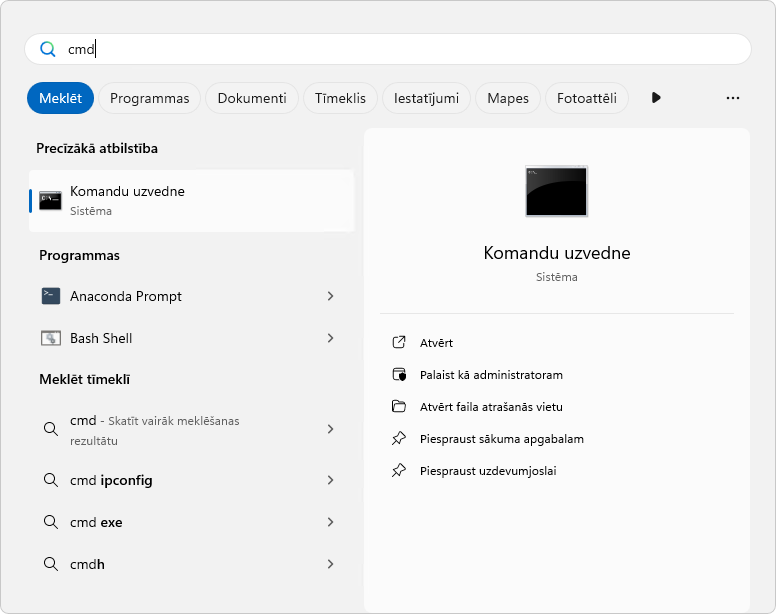
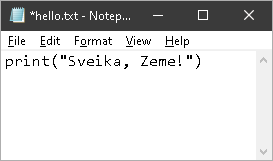
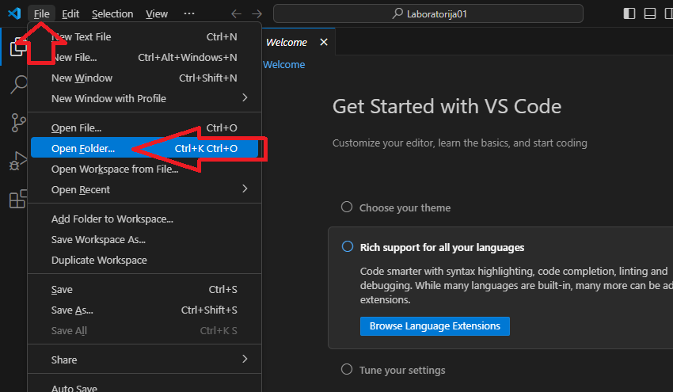
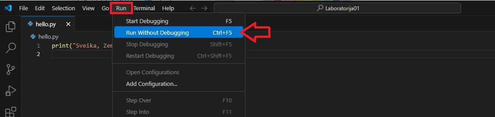

# 2. nodarbība. Ievads Python, pirmās programmas

**Kopīgi izpildāmie uzdevumi nodarbībā.**

## Komandrindas izmantošana

Atrodi komandrindu (*CLI command line interface*) un izmēģini dažas komandas!



Komandas:

```bash
dir
cd Desktop
cd ..
cd Desk + spiežam pogu TAB
md DatZB011
md DatzB011
md "Mape ar atstarpi"
python.exe -V
```

**Jautājumi:**

1. Kas notiek, ja uz tastatūras spiež bultiņas uz augšu un leju?
2. Kas notiek, ja spiež pogu F7?

## Pirmā programma

No komandrindas sava profila darbavirsmā (*Desktop*) izveido mapi `C:\Users\students\Desktop\DatZB011\Laboratorija02`.
Ar programmu Piezīmjbloks (*Notepad*) šajā mapē izveido failu `C:\Users\students\Desktop\DatZB011\Laboratorija02\hello.txt`



No komandrindas izpildām

```bash
cd Desktop\DatZB011\Laboratorija02
python.exe hello.txt
```

Pārdēvējam faila paplašinājumu no `*.txt` uz `*.py`:

```bash
ren hello.txt hello.py
dir
python.exe hello.py
```

## *Python* kā viedais kalkulators

Izmēģini aritmētiskās darbības:

`+`
`-`
`*`
`/`
`%`
`**`
`//`
un iekavas `(1+3)*4`

Vēl:

```bash
>>> import math
>>> math.pi
3.141592653589793
>>> math.cos(math.pi)
-1.0
```

## Visual Studio Code

Atveram mapi `C:\Users\students\Desktop\DatZB011\Laboratorija02` ar `Visual Studio Code`.



Un atveram iepriekš izveidoto `hello.py` failu.

Programmas izpilde.



>[!NOTE]
> Pierodam spiest `F5` vai `Ctrl+F5`
>
> Atkļūdošanas režīmā programmas darbojas lēnāk!

## Mainīgo tipi

Izveido jaunu failu `tipi.py`.

```python
a = 2
print(a)
print(type(a))
```

Un izmēģinām programmu.

## 1. uzdevums

Nosaki tipu šādiem mainīgajiem:

```python
b=3.14
c=7/2
d=7//2
s="teksts"
z=2+3j
```

## 2. uzdevums

Vairāki mainīgie reizē.

Uzraksti programmu, kas samaina x un y vietām.

```python
x, y = 2, 3
print(x, y)
```

## 3. uzdevums

Skaitļi binārajā un heksadecimālajā sistēmā

**Kādas ir mainīgo vērtības decimālajā sistēmā?**

```python
n=0b10001111
m=0x8f
```

## Mainīgo tipa maiņa (Type Casting)

```python
s="3.14"
print(s)
print(type(s))

print(float(s))
# kļūda print(int(s))

f=float(s)
print(int(f))
```

```python
pi=355/113
print ("pi ir "+ str(pi))
```

```python
print (bool(1))
print (bool(0))
print (bool(-3))
```

```python
z=3+4j
r=z.real
print(r)
```

Vairāk par datu tipiem var uzzināt šajā dokumentā: [Built-in Types](https://docs.python.org/3/library/stdtypes.html).

## Teksta mainīgie (string)

```python
s1 = 'vienkāršās pēdiņas'
s2 = "dubultās pēdiņas"
print("vienalga, vai", s1, "vai", s2)
```

```python
s3 = """Es
esmu
ļoti
garš"""
print (s3)
```

```python
s4="Fiziķiem patīk grieķu alfabēts αβγδεζηθ..."
print(s4)
```

```python
s5="""Mans simbolu špikeris
Al₂O₃ ir labākais metāla oksīds pasaulē
Bulgāru valodā най-добрият метален оксид

ASCII(230) µ - mikro
UTF8(CEBC) μ grieķu m
pakāpes
x⁰¹²³⁴⁵⁶⁷⁸⁹ x⁽ᵃᵇᶜᵈᵉᶠᵍʰⁱʲᵏˡᵐⁿᵒᵖʳˢᵗᵘᵛʷˣʸᶻ⁺ⁿ⁻⁾⁼
indeksi
x₀₁₂₃₄₅₆₇₈₉₊₋₌₍₎ₐₑₒₓₕₖₗₘₙₚₛₜ

° - grādi
℃ - pēc Celsija skalas

• trekns punkts
(a·b) skalārais reizinājums
± plus mīnus
Å Angstrēms
Ω omega
Δ delta

cm⁻¹ - apgrieztie centimetri
€
≈≠≤≥
"""
print(s5)
```

Drīkst arī tā:

```python
αβ="grieķiem patīk fizika"
print(αβ)
```

Numerācija sākas no 0:

```python
s='abcdef'
print(s)
print(s[0])
print(s[1])
print(s[-1])
print(s[-2])
print(s[1:4]) # līdz ceturtajam (neieskaitot)
print(s[8]) # kļūda
```

## Teksta formatēšana

Vairāk informācijas: [String Formatting Cookbook](https://mkaz.blog/working-with-python/string-formatting).

```python
a=35500000/113
s=f"{a}"
print(s)

print(f"{a}")
print(f"{a:.2f}")
print(f"{a:.2e}")
print(f"{a:E}")
```

>[!WARNING]
> Bieži skaitļu formatēšana ir kļūdu avots eksperimentu automatizācijas programmās.

## Datu ievade

```python
v=input("Kas Tu esi? ")
print(f"Labdien, {v}!")
```

**Papildus uzdevumi prasmju nostiprināšanai.  
_Izpilde nav obligāta, bet ir vēlama!_**

1. Definēt trīs veselu skaitļu mainīgos. Veikt ar tiem 5 dažādas aritmētisku darbību kombinācijas pēc izvēles un izvadīt rezultātu uz ekrāna. Izvadam uz ekrāna ir pievienots arī teksts ar atšifrējumu, piemēram, ja a=2, b=3 un c=5 uz ekrāna izvada: a+b\*\*c = 245, kā arī (a + b)/c = 1 un vēl trīs darbības.
2. Spiediena mērvienības. Izveidojiet programmu, kas lietotāja ievadīto spiedienu kPa pārveidos uz PSI, mmHg un atmosfērās. Uz ekrāna jāizvada spiediens visās vienībās, Koeficientus un nepieciešamās formulas nepieciešams atrast internetā.
3. Izveidot programmu, kas prasa ievadīt planētas masu un blīvumu. Pēc šo lielumu ievades, programma uz ekrāna parāda tekstu, kur pateikts, kāds ir planētas rādiuss.
4. Skaitļu formatēšana ([špikeris](https://mkaz.blog/working-with-python/string-formatting)). Izveidot programmu, kurā ir definēts mainīgais ar skaitlisku vērtību: daļskaitli starp 1 un 10 miljoniem (piemēram, 3412352.6234). Programma izvada uz ekrāna šī mainīgā vērtību noformētu trīs dažādos veidos:
    * normālformā ar trīs zīmīgajiem cipariem un vienmēr parādītu zīmi (piemēram, +3.4e+06),
    * ar tūkstošiem atdalītiem ar komatu (piemēram, 3,412,352.6234) un
    * ar diviem cipariem aiz komata (piemēram, 3412352.62).
