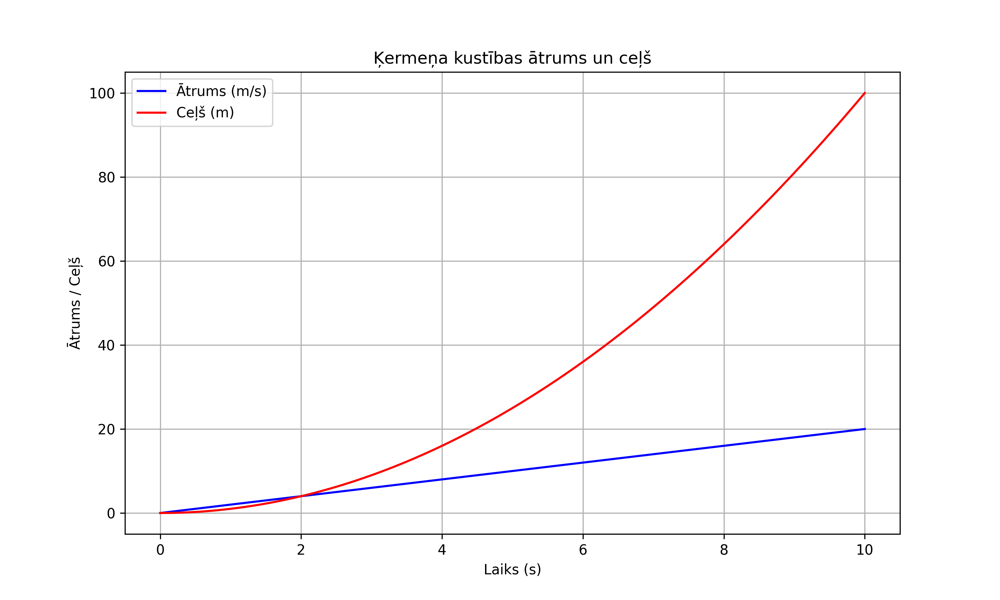
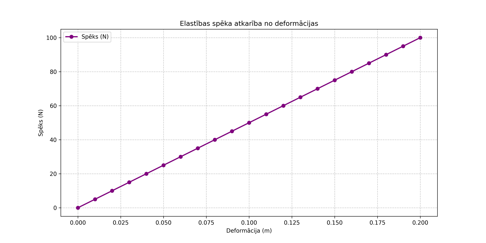
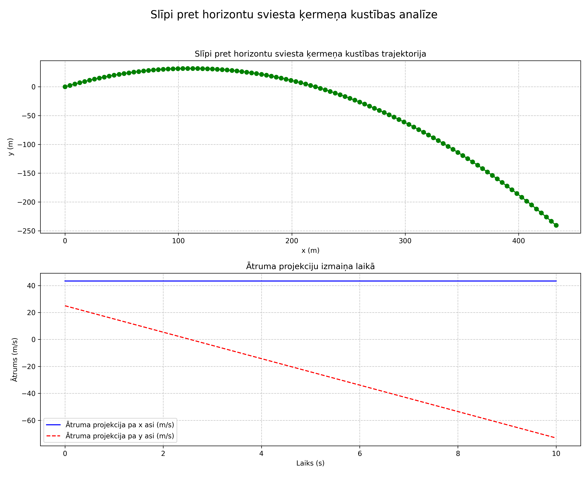
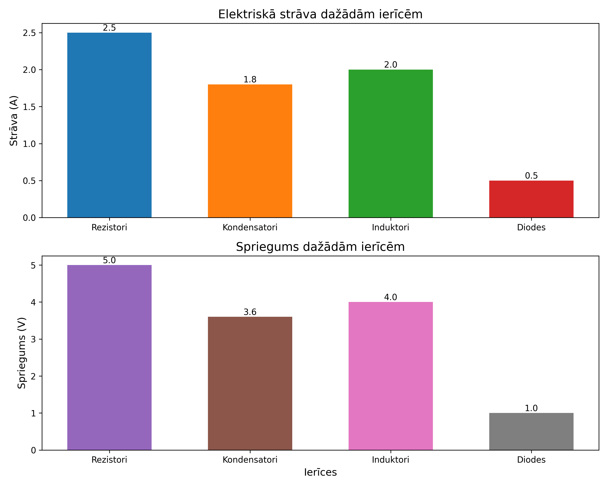
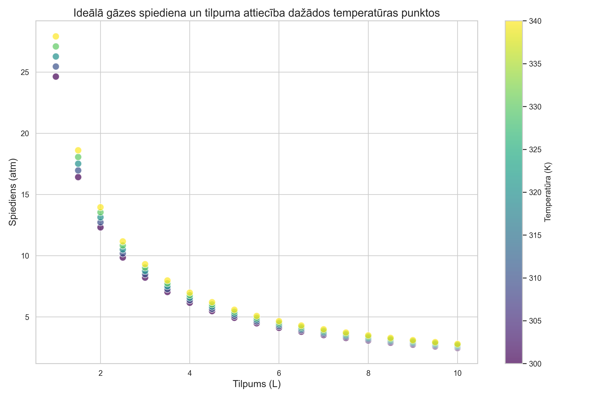

# 5. nodarbība. Grafiku zīmēšana I

## 1. uzdevums. Vienkāršu grafiku izveide ar Matplotlib

**Uzdevums**: Izveidojiet grafiku, kas attēlo ķermeņa kustības ātrumu un veikto ceļu. Ķermenis atrodas vienmērīgi paātrināta taisnlīnijas kustībā.

Sākuma ātrums $v_0 = 0 \; m/s$  
Paātrinājums $a = 2 \; m/s^2$  
Laika periods $t$ ir 0 līdz 10 sekundēm ar soli 0,1 s

Darba gaita:

1. Izveidojiet laika masīvu (t) no 0 līdz 10 sekundēm ar soli 0,1 s, izmantojot ciklu vai `NumPy`.
2. Aprēķiniet ātrumu katrā laika punktā, izmantojot formulu $v=v_0 + a \cdot t$.
3. Aprēķiniet veikto ceļu katrā laika punktā, izmantojot formulu $l=v_0 \cdot t + 0,5 \cdot a \cdot t^2$.
4. Izmantojot `Matplotlib`, uzzīmējiet divus grafikus vienās asīs:
   - Ātruma ($v$) atkarība no laika ($t$);
   - Ceļa ($l$) atkarība no laika ($t$).
5. Pievienojiet virsrakstu "Ķermeņa kustības ātrums un ceļš".
6. Pievienojiet asu nosaukumus grafikiem.
7. Noformējiet grafiku (pievienojiet režģlīnijas, krāsas u.tml.).



## 2. uzdevums. Grafiku eksportēšana dažādos formātos

**Uzdevums**: Izveidojiet grafiku, kas attēlo elastības spēka $F_{el}$ un deformācijas $\Delta x$ attiecību, un eksportējiet šo grafiku gan PNG, gan PDF formātos.

Elastības spēks: $F_{el} = k \cdot \Delta x$  
Stinguma koeficients: $k = 500~N/m$  
Deformācija $\Delta x$ ir $0$ līdz $0,2$ m ar soli $0,01$ m

Darba gaita:

1. Izveidojiet masīvu (`delta`), kurā tiek fiksēta deformācija no $0$ līdz $0,2$ m ar soli $0,01$ m, izmantojot ciklu vai `NumPy`.
2. Aprēķiniet spēku $F$ katrā deformācijas punktā.
3. Izmantojot `Matplotlib`, izveidojiet grafiku, kur:
   - X ass: Deformācija $\Delta x~(m)$;
   - Y ass: Spēks $F~(N)$.
4. Pievienojiet virsrakstu, asu etiķetes un režģlīnijas.
5. Noformējiet grafiku ar atbilstošām krāsām un līniju stiliem.
6. Saglabājiet grafiku kā PNG failu ar nosaukumu `uzvārds_2uzd.png`.
7. Saglabājiet grafiku arī kā PDF failu ar nosaukumu `uzvārds_2uzd.pdf`.
8. Nododiet PDF testā atbilstošajā jautājumā.



## 3. uzdevums. Vairāku grafiku attēlošana vienā attēlā

**Uzdevums**: Izveidojiet attēlu, kas sastāv no diviem grafikiem – viens attēlo slīpi pret horizontu sviesta ķermeņa kustības trajektoriju, otrs attēlo $v_x$ un $v_y$ laikā.

Sākuma ātrums $v_0 = 50~m/s$  
Leņķis $\theta = 30°$  
Laiks $t$ ir 0 līdz 10 sekundēm ar soli 0,1 s

Darba gaita:

1. Izveidojiet laika masīvu (`t`) no 0 līdz 10 sekundēm ar soli 0,1 s, izmantojot ciklu vai `NumPy`.
2. Aprēķiniet sākuma ātruma komponentes: $v_{0x} = v_0 \cdot \cos \theta$; $v_{0y} = v_0 \sin \theta$
3. Aprēķiniet trajektorijas koordinātas katrā laika punktā: $x = v_{0x} \cdot t$; $y = v_{0y} \cdot t – 0,5 \cdot g \cdot t^2$
4. Aprēķiniet ātruma projekcijas katrā laika punktā: $v_x = v_{0x}$; $v_y = v_{0y} – g \cdot t$
5. Izmantojot `plt.subplots`, izveidojiet divas grafikus kā vienu attēlu:
   - Pirmajā apakšgrafikā attēlojiet trajektoriju ($x$ pret $y$).
   - Otrajā apakšgrafikā attēlojiet ātruma komponentes ($v_x$ un $v_y$ pret $t$).
6. Pievienojiet katram grafikam virsrakstus, asu nosaukumus un režģlīnijas.
7. Noformējiet grafikus, izmantojot dažādas krāsām un līniju stilus.
8. Pievienojiet kopīgu virsrakstu attēlam (abiem grafikiem).



## 4. uzdevums. Stabiņu diagrammu izveide

**Uzdevums**: Izveidojiet stabiņu diagrammu, kas attēlo dažādu ierīču elektrisko strāvu un spriegumu vienā ķēdē.

Ierīces: `['Rezistori', 'Kondensatori', 'Induktori', 'Diodes']`  
Strāva (A): `[2.5, 1.8, 2.0, 0.5]`  
Spriegums (V): `[5, 3.6, 4.0, 1.0]`  
Krāsas strāvai: `['#1f77b4', '#ff7f0e', '#2ca02c', '#d62728']`  
Krāsas spriegumam: `['#9467bd', '#8c564b', '#e377c2', '#7f7f7f']`

Darba gaita:

1. Definējiet ierīču nosaukumus, to strāvas un sprieguma vērtības.
2. Izveidojiet divas atsevišķas stabiņu diagrammas (vienu strāvai un otru spriegumam) vienā attēlā, izmantojot `plt.subplots`.
3. Katram stabiņam piešķiriet krāsu, kas ir norādīta augstāk.
4. Pievienojiet virsrakstus, asu nosaukumus un apzīmējumus.
5. Izmainiet stabiņu stilu, piemēram, pievienojot noapaļotus stūrus.
6. Pievienojiet vērtību etiķetes virs katra stabiņa.
7. Izmantojiet pielāgotu tēmu vai stilu no `Matplotlib` (pēc pašu vēlmes), lai diagrammas būtu vizuāli pievilcīgas.
8. Saglabājiet diagrammas PDF ar nosaukumu `uzvārds_4uzd.pdf`.



## 5. uzdevums. Datu vizualizācija ar Seaborn bibliotēku

> [!IMPORTANT]
> Pirms uzdevuma izpildes nepieciešams installēt `Seaborn` bibliotēku, izmantojot:

```bash
pip install seaborn
```

**Uzdevums**: Izmantojot `Seaborn`, izveidojiet izkliedes (*scatter*) grafiku, kas attēlo ideālā gāzes spiediena un tilpuma attiecību dažādos temperatūras punktos.

- Ideālā gāzes likums: $V = nRT$
- Pieņemsim, ka $n = 1~mol$, $R = 0,0821 \frac{L \cdot atm}{mol \cdot K}$
- Tilpums $V$ = 1 līdz 10 litriem ar soli 0,5 L
- Temperatūra $T$ = dažādi punkti (300 K, 310 K, 320 K, 330 K, 340 K)

Darba gaita:

1. Izveidojiet tilpuma masīvu (`V`) no 1 līdz 10 litriem ar soli 0,5 L.
2. Aprēķiniet spiedienu $p$ katram tilpuma punktam dažādos temperatūras punktos, izmantojot ideālā gāzes likumu.
3. Izveidojiet datu struktūru, kas satur informāciju par tilpumu, spiedienu un temperatūru.
4. Izmantojot `Seaborn`, izveidojiet izkliedes grafiku, kur:
   - X ass: Tilpums $V$
   - Y ass: Spiediens $p$
   - Krāsa: Temperatūra $T$
5. Izmantojiet punktu izmērus vai formātus, lai norādītu temperatūras diapazonu.
6. Pievienojiet virsrakstu, asu etiķetes un krāsu apzīmējumus.
7. Pielāgojiet grafika stilu, izmantojot `Seaborn` tēmas un elementus.



## Papildus uzdevumi

**Papildus uzdevumi prasmju nostiprināšanai.  
*Izpilde nav obligāta, bet ir vēlama!***

1. Programmā definēt kvadrātvienādojuma koeficientus $a$, $b$ un $c$.  
   Aprēķināt kvadrātvienādojuma saknes pēc parastās skolas formulas, attēlot kvadrātvienādojuma grafiku ar līniju un noteiktās saknes ar punktiem. Programmai jāstrādā pareizi pie jebkurām koeficientu vērtībām.

2. Izveidot programmu, kas aprēķina bankas noguldījuma attīstību laikā.  
   Pieņem, ka noguldīti 1000€ ar 8 % likmi gadā uz 30 gadiem. Attēlot noguldījuma izaugsmi, ja procentuālo piemaksu aprēķina  
   1) ik gadu,  
   2) ik pusgadu (pusgada likme 8 % / 2),  
   3) ik mēnesi (mēneša likme 8 % / 12),  
   4) ik dienu,  
   5) nepārtraukti.  
   Visas līknes attēlot vienā grafikā, apzīmētas ar nosaukumiem.

3. [Montekarlo π noteikšana](https://en.wikipedia.org/wiki/Monte_Carlo_integration).  
   Ar nejaušu skaitļu ģeneratoru radīt $N$ skaitļu pārus jeb punkta $(x,y)$ koordinātas intervālā no -1 līdz 1. Attēlot grafiski vienības riņķi, kā arī visus punktus. Tos iekrāsot dažādās krāsās atkarībā no piederības vienības riņķim. Grafika virsrakstā norādīt noteikto $\pi$ vērtību (figūru laukumu attiecība ir aptuveni vienāda ar tajās "iekritušo" punktu skaitu attiecību).

4. Parādīt iepriekšējā uzdevuma metodes konverģenci, t.i. attēlot grafikos gan $\pi$ novērtējuma attīstību un patieso $\pi$ vērtību, gan novērtējuma absolūto novirzi no patiesās vērtības, atkarībā no izmantoto punktu skaita $N$.  
   Pirmo grafiku veidot lineārā $y$ ass mērogā, otro – logaritmiskos abu asu mērogos.
