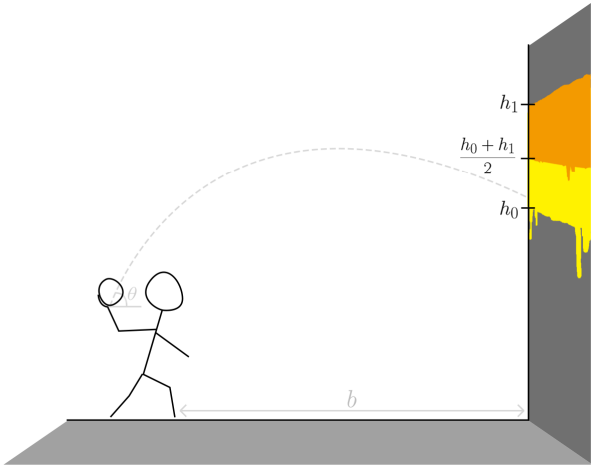

# 1. Patstāvīgais darbs

> [!IMPORTANT]
> **Termiņš**: piektdiena, 2025. gada 24. oktobris, 23:59
>
> **Iesniegšana**:
> Pievienot e-studijās .pdf failu ar kodu, attēliem un komentāriem.

## Kā noformēt patstāvīgo darbu?

- Izmanto $\LaTeX$ dokumenta veidošanai
- Izmanto `latex_sagatave.tex` kā sagatavi (sagatave ir [šeit](https://github.com/AnthonyTSV/DatZB011/blob/main/08-Week/latex_sagatave.tex))
- Ievieto savu vārdu un uzvārdu dokumenta augšdaļā
- Pievieno savu kodu, attēlus un komentārus pie katra uzdevuma
- Iesniedz dokumentu e-studijās līdz noteiktajam termiņam
- Iesniedzams ir tikai `.pdf` fails
- Faila nosaukums: `1_PD_{ID}.pdf`, piemēram, `1_PD_jb12345.pdf`

## 1. uzdevums. Ķīmiskie elementi vārdnīcā

Aplūkosim vārdnīcu `elements_10`, kurā ir 10 pirmie ķīmiskie elementi no periodiskās tabulas:

```python
elements_10 = {1: '', 2: 'Helijs', 3: 'Litijs',
4: 'Berilijs', 5: 'Bors', 6: 'Ogludenradis',
7: 'Slapeklis', 8: '',
9: 'Fluors', 10: 'Neons'}
```

a) Ķīmiskie elementi ar 1. (ūdeņradis) un 8. numuru (skābeklis) pazuda.
Nokopējiet `elements_10` savā failā un izlabojiet vārdnīcu tā, lai atslēgām 1 un 8 būtu pareizās vērtības. Izmantojiet šo paņēmienu:

```python
vardnica[atslega] = 'vertiba'
```

b) Nokopējiet sekojošo kodu savā skriptā un palaidiet to. Atrodiet atšķirību starp divām izdrukātajām vārdnīcām un izskaidrojiet, kāpēc tās ir atšķirīgas.

```python
elements_10_copy = elements_10.copy()
elements_10_copy.update({11: 'Natrijs'})
print(elements_10)
print('\n')
elements_11 = elements_10
elements_11.update({11: 'Natrijs'})
print(elements_10)
```

## 2. uzdevums. Izlabo Einšteina kodu

Speciālā relativitāte ir fizikas nozare, kas apraksta kustības ar ļoti lieliem ātrumiem.
Šajā teorijā objekta impulss $p$ ar ātrumu $v$ (m/s) un masu $m$ (kg) ir:

$$
p = m \cdot v \cdot \gamma, \; \gamma = \frac{1}{\sqrt{1 - \frac{v^2}{c^2}}},
$$

kur $c \approx 300 \, 000 \, 000$ m/s ir gaismas ātrums. Tālāk redzamā programma mēģina aprēķināt objekta impulsu, ja tā ātrums ir $\tfrac{1}{3}$ no gaismas ātruma un masa $m = 0.14$ kg. Programmā ir daudz kļūdu, un tā nestrādā.
Nokopējiet programmu, palaidiet to, izlabojiet kļūdas un panāciet, lai tā darbojas pareizi.

```python
from math import squareroot
c = 300 000 000 # m/s
v = 100 000 000 # m/s
m = 0,14 # kg
gamma = 1 / squareroot (1 -( v ^2/ c ^2) )
p = m * v * gamma
print p
```

## 3. uzdevums. Iterācijas cauri cilpu rādiusiem

Lai varētu izbraukt cauri cilpai, nepieciešams minimālais ātrums, lai nezaudētu kontaktu ar cilpas virsmu.

Pieņemsim, ka kaskadieris brauc cauri cilpai. Lai kaskadieris visā kustībā saglabātu kontaktu ar cilpu, nepieciešams, lai ātrums būtu vismaz:

$$
v = \sqrt{g r}
$$

Šeit, $g = 9.81 \~ m/s^2$ un $r$ ir cilpas rādiuss (metros).

---

Jums ir dota programma, kas izmanto `while` ciklu, lai iterētu cauri dažādu cilpu rādiusu sarakstam $r$.
Katram rādiusam $r$ tiek aprēķināts un izdrukāts minimālais ātrums $v$:

```python
from math import sqrt

g = 9.81
r = [2.7, 3.43, 5.62, 7.1]
num_loops = len(r)
v = [0] * num_loops

i = 0
while i < num_loops:
    v[i] = sqrt(r[i] * g)      # m/s
    v[i] = v[i] * 3600 / 1000  # convert to km/h
    print("Least speed to complete the loop: %.2f km/h" % v[i])
    i += 1
```

**Uzdevums**:
Pārveidot programmu, lai tā
1. izmantotu `for` ciklu, nevis `while` ciklu;
2. izdrukā $v$ vērtības atsevišķā ciklā pēc visu $v$ aprēķina.

## 4. uzdevums. Populācijas pieaugums

Populācijas izaugsmi bieži apraksta ar loģistisko funkciju:

$$
N(t) = \frac{B}{1+C e^{-kt}},
$$

kur $B$ ir sugas ietilpība vidē (maksimālais populācijas lielums, ko vide var uzturēt ilgtermiņā).
Konstante $k$ raksturo izaugsmes ātrumu, savukārt $C$ tiek noteikts no sākuma apstākļiem.

Apsveriet baktēriju koloniju ar parametriem:

- ietilpība $B = 50000$

- $k = 0.2 , h^{-1}$ (h – stundas)

- sākuma populācija $N(0) = 5000$

a) Izmantojot sākuma nosacījumu, noteikt $C$.

b) Uzrakstīt programmu, kas aprēķina baktēriju skaitu pēc 24 stundām.

c) Uzzīmēt baktēriju pieauguma grafiku 24 stundu laikā, izmantojot logaritmisko skalu y asij.

>[!TIP]
> Lai atrastu $C$, ievietojiet $t = 0$ iepriekšējā izteiksmē un atrisiniet iegūto vienādojumu. Tā iegūsiet formulu $C$ aprēķinam kā funkciju no $N$ un $B$, ko var izmantot programmā.

## 5. uzdevums. Trāpīt mērķī

Simulēsim spēli, kur bumba tiek mesta pret sienu ar uzkrāsotu mērķi. Punkti tiek piešķirti atkarībā no tā, kur bumba trāpa.



_Ilustrācija sistēmai, uz kuras pamata veidosim simulāciju._

Bumbas augstumu var aprakstīt ar funkciju:

$$
y(t) = -\frac{1}{2} g t^2 + v_0 t \sin(\theta),
$$

kur $v_0$ ir sākuma ātrums, $\theta$ ir mešanas leņķis, un $g = 9.81 , m/s^2$.

a) Uzrakstīt funkciju, kas atgriež bumbas augstumu dotajā laikā $t$.

b) Modeļa ietvaros bumba trāpīs sienai laikā

$$
T = \frac{b}{v_0 \cos(\theta)},
$$

kur $b$ ir attālums līdz sienai.
Pēc $y(T)$ vērtības noteiks punktus. Punktu skaits tiek aprēķināts un atgriezts ar funkciju, kuru jāuzraksta pašam.

Mērķis atrodas uz sienas no augstuma $h_0$ līdz $h_1$ ($h_0 < h_1$).
Punkti tiek piešķirti pēc šādiem noteikumiem:

Punkti tiek piešķirti pēc šādiem noteikumiem:

- Saņem 0 punktus, ja $y(T) < h_0$ vai $y(T) > h_1$
- Saņem 1 punktu, ja $h_0 ≤ y(T) < 1/2 (h_1 + h_0)$
- Saņem 2 punktus, ja $1/2 (h_1 + h_0) ≤ y(T) ≤ h_1$

**Uzdevums**:

a) Uzrakstīt programmu, kas ar for ciklu izdrukā punktu skaitu, ja
$h_0 = 3 , m$, $h_1 = 3.5 , m$, $\theta = \pi/4$, $b = 3.5 , m$ un $v_0 = 15, 16, 19, 22 , m/s$.

b) Uzzīmēt grafiku, kas rāda sakarību starp sākuma ātrumu $v_0$ un iegūtajiem punktiem.

**Uzdevumi adaptēti no Oslo universitātes (IN1900 kursa uzdevumiem)[https://www.uio.no/studier/emner/matnat/ifi/IN1900/h25/index.html]**
