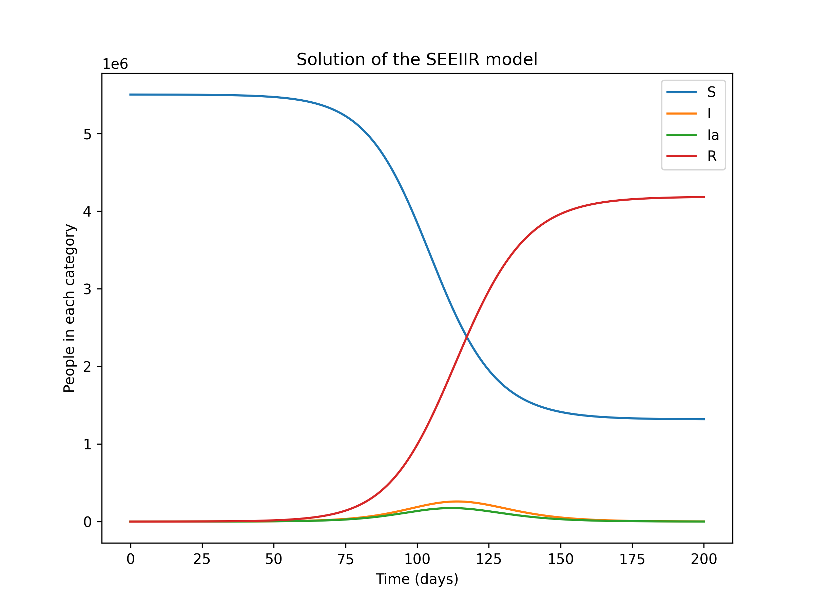
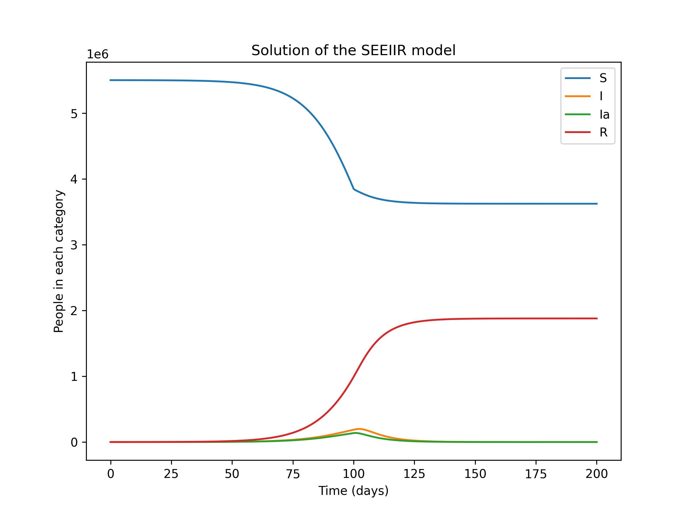
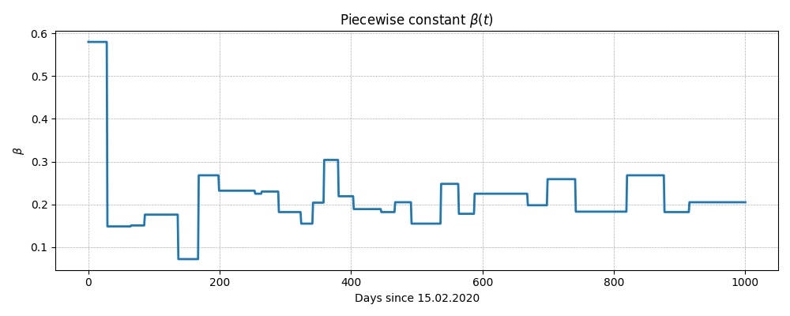
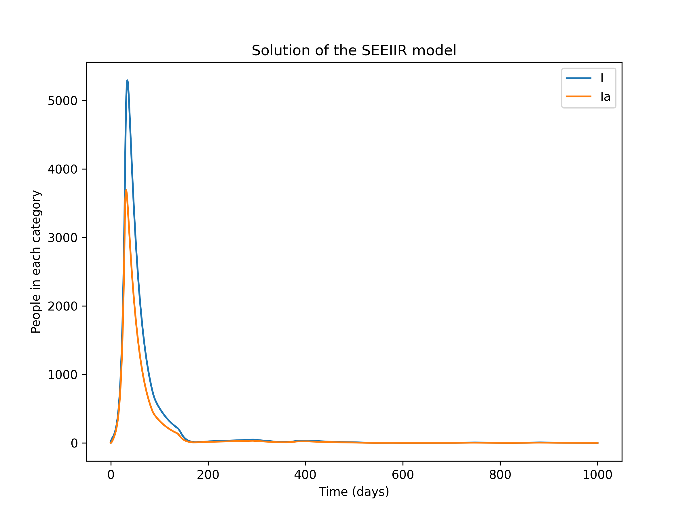
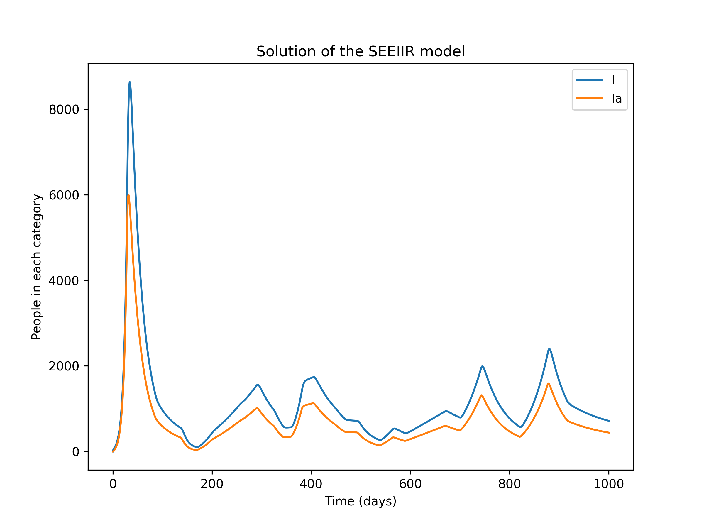

# 2. daļa (LV)

## Pandēmijas modelēšana ar Diferenciālvienādojumiem un Python (_uzdevumi adaptēti no IN1900 UiO kursa_) ##

> [!IMPORTANT] Uzmanīgi!
> - Šī daļa ir 60% no 2. PD
> - Termiņš: piektdiena, 2025. gada 19. decembris, 23:59

> [!WARNING] AI izmantošana
>
> Ja izmantojat AI, piemērojiet to pakāpeniski vienai apakšproblēmai vienlaikus un pārbaudiet,
> vai iegūtais risinājums ir pareizs un vai jūs to saprotat, pirms pāriet uz nākamo soli.
>
> Ielīmējot visu problēmas aprakstu ChatGPT vai līdzīgos rīkos, jūs, visticamāk, iegūsiet risinājumu, bet ļoti iespējams, ka tas būs risinājums nedaudz atšķirīgai problēmai.
>
> Tas netiks apstiprināts, un var būt ļoti grūti pielāgot ģenerēto kodu, lai tas atbilstu projekta prasībām.
>
> Gadījumos, kad mums rodas aizdomas par pārmērīgu AI rīku izmantošanu, jums varlūgt paskaidrot savu kodu DatZB011 pasniedzējiem.
>
> Ja nevarat paskaidrot, kā strādā Jūsu kods, projekts netiks apstiprināts.

> [!NOTE] Padoms
> Lai labāk orientētos tēmā un saprastu vienādojumus var izlasīt šīs [grāmatas 5. nodaļu](https://link.springer.com/book/10.1007/978-3-031-46768-4).

## 1.0 Sākums

- Lejupielādējiet arhīvu `files.zip`
- Izpakojiet `files.zip` ar funkciju "Extract All" uz vēlamo mapi

- Jums vajadzētu būt failiem `beta_values.txt`, `covid19.py`, `lockdown.py`, `outbreak.py`, `SEIR.py`, `ODESolver.py`, `README.md` un `SEIR0.py`.
- Palaižiet `ODESolver.py`, lai pārbaudītu, vai viss darbojas. Tam vajadzētu izvadīt: `All methods passed the exact solution test.`
- Tagad esam gatavi sākt.

## 1. Uzdevums. Filename: `SEIR0.py`

### 1.1

- Izveidojiet testa funkciju `test_SEIR0()`, lai pārbaudītu, vai klases izsaukšanas funkcija darbojas pareizi.
- Testa funkcijā jums jāizveido klases instances, izmantojot vai nu noklusējuma parametru vērtības, vai paša izvēlētas vērtības.
- Tad izsauciet instanci ar piemērotiem argumentiem `t`, `u`, piemēram, `t=0` un `u=[1,1,1,1,1,1]` vai kādu citu variantu, kas atvieglo rezultāta aprēķināšanu ar rokām, un salīdziniet izvadi ar gaidītajām vērtībām.
- Atcerieties salīdzināt vērtības ar `expected_du` (piemēram, `tol=1e-10`), jo izvades ir peldošie skaitļi.

> [!NOTE] Padoms
> Te var palīdzēt `assert np.allclose(du, expected_du, atol=1e-10)`

### 1.2

- Izveidojiet funkciju `solve_SEIR(model, T, N, S_0, E2_0)`, kas kā pirmo argumentu pieņem `SEIR0` klases instanci un atrisina diferenciālvienādojumu sistēmu.
- Izmantojiet vienu no `SEIR0` hierarhijas risinātājiem, piemēram, `RungeKutta4` klasi.
- Vienādojumi jāatrisina no laika `0` līdz `T`, kur `T` ir soļu skaits `N`, kas tiek dots kā funkcijas arguments.
- Parametri `S_0`, `E2_0` ir sākotnējie nosacījumi kategorijām `S` un `E2`. Visi pārējie sākotnējie nosacījumi ir iestatīti uz nulli, tādēļ pilnīgie sākotnējie nosacījumi DV sistēmai ir `[S_0, 0, E2_0, 0, 0, 0]`. Funkcijai jāatgriež masīvi `t`, `u`, kas satur laiku un atrisinājumu.

### 1.3

- Izveidojiet funkciju `plot_SEIR(t, u)`, lai vienā grafikā vizualizētu $S(t)$, $I(t)$, $Ia(t)$ un $R(t)$ komponentes.
- Iekļaujiet leģendu ar katras līknes apzīmējumiem un ašu nosaukumiem.


_Att. 1: SEEIIR modeļa atrisinājums. Grafiks parāda kategoriju $S,I,Ia,R$ dinamiku._

### 1.4

- Visbeidzot, izveidojiet `SEIR0` klases instanci no uzd. 1.1 , ar $\beta$ = 0.4 un visiem pārējiem parametriem ar noklusējuma vērtībām.
- Izsauciet funkcijas no 1.2, lai atrisinātu modeli sākotnējām vērtībām `S_0 = 5,5e6`, `E2_0 = 100`, visām pārējām sākotnējām vērtībām nulle, `T = 200` un `N = 400`.
- Izsauciet funkciju no 1.3, lai attēlotu risinājumu.
- Rezultātā iegūtais attēls būtu jāizskatās tieši tāpat kā attēlā 1
- Pārliecinieties, ka funkciju izsaukumi ir ievietoti testa blokā faila apakšā, t.i.:

```python
if __name__ == "__main__":
    model = SEIR0(beta = 0.4)
    ...
```

Koda ievietošana šajā testā ir noderīga, jo turpmākajos uzdevumos jūs importēsiet no faila `SEIR0.py`, un mēs negribam, lai šīs rindas tiktu izpildītas, kad kods tiek importēts.

## 2. Uzdevums. Modificējiet SEIR0 klasi. FIlename: `SEIR0.py`

Šajā uzdevumā mēs paplašināsim 1. uzdevuma klasi, lai atbalstītu laika atkarīgus modeļa parametrus. Kods jāraksta kā atsevišķs fails `SEIR.py`, kurā jāimportē nepieciešamās daļas no `SEIR0.py`.

### 2.1

Uzrakstiet klasi `SEIR` kā `SEIR0` apakšklasi. Jaunajai klasei jāpieņem, ka parametrs `beta` var tikt dots kā konstante vai kā Python funkcija (no laika atkarīga funkcija). To var izdarīt, ievietojot konstruktorā līdzīgu `if` testu:

```python
if isinstance(beta, (float, int)): # is it a number?
  self.beta_function = lambda t: beta # wrap as function
elif callable(beta):
  self.beta_function = beta
super().__init__(self.beta_function(0), ...)
```

Pārējie parametri tiek nodoti nemainīti bāzes klases konstruktoram.
Metode `__call__(self, t, u)` arī būs gandrīz identiska
klasei 1. uzdevumā, tādēļ mēs varam izsaukt bāzes klases metodi, lai samazinātu koda dublēšanos. Metodes `__call__` sākumā jums jāatjaunina atribūts self.beta, izmantojot atbilstošu izsaukumu self.beta_function, un tad jūs varat izsaukt metodi no bāzes klases. Nevajadzētu vienkārši kopēt metodes no SEIR0 klases un modificēt tās apakšklasē. Mantojuma mērķis ir samazināt koda dublēšanos, un tas ir šīs problēmas galvenais elements.

### 2.2

Uzrakstiet divas testa funkcijas `test_SEIR_beta_const` un `test_SEIR_beta_var`, lai pārbaudītu, vai klase darbojas pareizi. Pirmā funkcija jāizmanto, lai pārbaudītu klasi ar nemainīgu beta, un tā var būt identiska testa funkcijai 1. uzdevumā. Otrai funkcijai jādefinē mainīga beta, piemēram, lineāra vai gabalu konstanta funkcija (piecewise function), un jāpārbauda, vai modelis dod gaidīto rezultātu divām dažādām t vērtībām.

### 2.3

Uzrakstiet jaunu funkciju `plot_SEIR(t, u, components=['S','I','Ia','R'])`.
Tai vajadzētu būt nedaudz uzlabotai versijai no 1. uzdevuma, kur papildu arguments `components` ir virkne/etiķešu saraksts, kas norāda, kurus risinājuma `components` mēs vēlamies attēlot, sākot no viena līdz sešām `u` komponentēm. Izņemot šo elastīgumu, funkcija ir tāda pati kā 1. uzdevumā. Jo īpaši, ņemot vērā `components` argumenta noklusējuma vērtību, ja izsauc jauno funkciju kā `plot_SEIR(t, u)`, rezultāts ir tieši tāds pats attēls kā 1. uzdevumā.

### 2.4

Pievienojiet šādu bloku faila beigās, lai izsauktu testu funkcijas, pēc tam izveidojiet modeļa klases instanci, atrisiniet problēmu un attēlojiet risinājumu:

```python
if __name__ == "__main__":
    test_SEIR_beta_const()
    test_SEIR_beta_var()
    model = SEIR(beta = 0.4)
    t, u = solve_SEIR(model, T = 200, N = 400,
    S_0 = 5.5e6, E2_0 = 100)
    plot_SEIR(t,u)
```

Rezultātā iegūtajam grafikam jāizskatās tieši kā 1. uzdevumā. Atrodiet
`I` kategorijas maksimumu, vai vizuāli pārbaudot grafiku, vai izmantojot iebūvēto `max` funkciju. Novērtējumi no pandēmijas sākuma fāzes norādīja, ka aptuveni 20% inficēto gadījumu būtu nepieciešama stacionāra aprūpe un 5% būtu nepieciešams mehāniskais ventilators. Norvēģijas slimnīcās ir apmēram 700 ventilatori.
Kā šis skaitlis salīdzinās ar jūsu aprēķiniem?

## Problem 3. Pandēmijas uzliesmojuma simulācija. Filename: `outbreak.py`

Šajā uzdevumā izmantosim klasi `SEIR` un risinātāja (solver) funkcijas no 2. uzdevuma, lai simulētu iespējamos Covid19 pandēmijas scenārijus Norvēģijā. Kods jāraksta atsevišķā failā `outbreak.py`, kam jāimportē klasi `SEIR` no `SEIR.py`.

Līdz šim mēs esam pieņēmuši, ka $\beta$ ir konstante. Parametrs $\beta$ apraksta varbūtību, ka inficēta persona (E2, I, Ia) sastopas ar kādu personu un inficē to. Realitātē $\beta$ ir atkarīga no daudziem faktoriem, tostarp no pašas slimības inficētspējas, iedzīvotāju imunitātes, kas iegūta vakcinācijas un iepriekšējo infekciju rezultātā, kā arī no iedzīvotāju vispārējās uzvedības dēļ. Tagad mēs paplašināsim mūsu modeli, lai izmantotu gabalu konstanti (piecewise constant) $\beta$.

Epidemiologi bieži atsaucas uz epidēmijas reprodukcijas koeficientu $R$,
kas ir vidējais jauno inficēto personu skaits, kuras inficējusi viena inficēta persona.
Kritiskais skaitlis ir $R = 1$, jo, ja $R < 1$, epidēmija samazināsies, bet, ja $R > 1$,
tā pieaugs eksponenciāli. Vienkāršākajos modeļos attiecība starp $R$
un $\beta$ ir $R = \beta \tau$, kur $\tau$ ir vidējais infekcijas perioda ilgums. Mūsu modelī, kurā ir vairākas infekcijas kategorijas, mums ir

$$
R = r_{e2} \beta / \lambda_2 + r_{ia} \beta / \mu + \beta / \mu,
$$

tāpēc, ka E2 perioda vidējais ilgums ir $1/ \lambda _2$ un gan $I$, gan $Ia$ vidējais ilgums ir $1/ \mu$. Izvēloties $\beta = 0,4$, iegūstam $R \approx 3,2$, kas ir līdzīgs
vērtībām, ko Norvēģijas Sabiedrības veselības institūts (FHI) izmantoja, lai modelētu epidēmijas sākuma posmu Norvēģijā no 2020. gada februāra vidus līdz marta vidum. Kā mēs visi
zinām, 2020. gada 12. martā tika ieviesti stingri ceļošanas un sociālo kontaktu ierobežojumi. Šie ierobežojumi ievērojami samazināja
kontaktu skaitu starp inficētajām un pret slimību neaizsargātajām personām, kas modelī ir attēlots kā parametra $\beta$ samazinājums.

Uzrakstiet funkciju `beta(t)`, kas attēlo gabalu konstanti (piecewise constant) $\beta$:

$$
\beta(t) = \begin{cases}
    0.4 & \text{if } t \leq 100 \\
    0.083 & \text{if } t > 100
\end{cases}
$$

Izveidojiet `SEIR` klases instanci ar šo gabalu konstanti $\beta$ un izsauciet funkcijas
`solve_SEIR` un `plot_SEIR`, lai atrisinātu problēmu. Rezultātā iegūtais grafiks būs līdzīgs attēlam 2.


_Att. 2: SEIR modeļa risinājums ar pārtrauktu $\beta$ funkciju. Grafiks parāda kategoriju $S,I,Ia,R$ dinamiku._

## 4. Uzdevums. Pandēmijas pārvaldība. Filename: `lockdown.py`

Kā mēs visi labi zinām, Covid19 pandēmija pāris gadu laikā būtiski ietekmēja sabiedrību, un inficēšanās gadījumu skaits pieauga un samazinājās vairākās viļņos. Vīrusa daudzās mutācijas ietekmēja tā inficētspēju, un biežās izmaiņas ceļošanas un sociālo kontaktu ierobežojumos arī ietekmēja slimības izplatību. FHI izstrādātajos modeļos, lai izprastu pandēmiju un prognozētu gaidāmos viļņus, šīs izmaiņas tika atspoguļotas kā $\beta$ parametra gabalu konstantes vērtības, līdzīgi kā iepriekšējā uzdevumā izmantotajā modelī, bet ar daudz vairāk soļiem. Fails `beta_values.txt` ar atbilstošām beta vērtībām jums jābūt `files` mapē. Vērtības ir balstītas uz parametru, ko FHI izmanto savos reālās pasaules pandēmijas modeļos, bet nedaudz pielāgotas, lai labāk atbilstu mūsu modelim.

Izveidojiet gabalu konstanti $\beta$ kā klasi `Beta`. Klasē jābūt
(vismaz) trim metodēm:

- Konstruktors `__init__(self, filename)`, kas kā argumentu pieņem failu formātā `beta_values.txt`, veic nepieciešamo faila apstrādi un
uzglabā $\beta$ vērtības un laika intervālus piemērotās datu struktūrās.

To var izdarīt vairākos veidos, bet viena no iespējām ir saglabāt divus vienāda garuma sarakstus: vienā ir $\beta$ vērtības, bet otrā ir intervāla sākuma datums, kad katra $\beta$ vērtība ir spēkā. (Izmantojot šo pieeju, var ignorēt katra intervāla beigu datumus.)

Mēs varam pieņemt, ka $t = 0$ mūsu modelī atbilst datumam 15.02.2020, tādējādi "datumu" saraksts var būt veseli skaitļi, skaitot no šī datuma. Šos sarakstus var izmantot kā meklēšanas tabulas `__call__` metodē, lai aprēķinātu $\beta$.

Lai konvertētu failā esošos datumus uz veselu skaitli, sākot no pirmā datuma, noderīgs ir modulis `datetime`. Nozīmīgākās `datetime` moduļa daļas ir divas klases, kas saucas `date` un `timedelta`, tādēļ
piemērota importēšanas instrukcija var būt

```python
  from datetime import date, timedelta
```

Var būt noderīgi arī ieviest metodi, kas konvertē failā izmantoto datuma formātu uz `date` objektu. Šāda metode var izskatīties, piemēram, šādi:

```python
def str2date(self, date_str):
    """
    Convert a date string on the format dd.mm.yyyy
    to a datetime.date object
    """
    day, month, year = (int(n) for n in date_str.split('.'))
    return date(year, month, day)
```

Ja jums ir divi datumi, kas attēloti kā datuma objekti, tos var atņemt, lai iegūtu `timedelta` objektu, un dienu skaitu var piekļūt kā `timedelta` klases atribūtu ar nosaukumu `days`. Šeit ir īss piemērs:

```python
# date0 and date1 are instances of class datetime.date
delta = date1 - date0
n_days = delta.days
```

Tā kā ievades faila apstrāde prasīs diezgan daudz rindu, konstruktors var izrādīties nedaudz garš un nesakārtots. Var būt noderīgi strukturēt kodu, definējot vienu vai vairākas metodes faila lasīšanai un apstrādei, un pēc tam izsaucot metodi(-as) no konstruktora.

- Metode `__call__(self, t)`, kas kā ievadi pieņem laiku un atgriež $\beta$ vērtību konkrētajai dienai. Ja konstruktorā izveidojāt divus sarakstus, kā ieteikts iepriekš, piemērota pieeja būtu iziet cauri šiem sarakstiem un pievienot atbilstošu `if` testu, lai atgrieztu pareizo $\beta$ vērtību.

To var izdarīt daudzos citos veidos, un daži no tiem, iespējams, ir eleganti, bet šī ir vienkārša pieeja, kas darbojas.

- Metode ar nosaukumu `plot(self, T)`, kas kā argumentu pieņem laika punktu T un attēlo $\beta$ funkciju $t$ starp 0 un $T$.

> [!NOTE] Padoms 1
> Lai grafiks atspoguļotu lēcienus un faktiski izskatītos kā
pārtraukta funkcija, ir jāizmanto diezgan daudz t vērtību. Piemēram,
izmantojot `t = np.linspace(0, T, 1000)`, grafiks izskatīsies diezgan labi.

> [!NOTE] Padoms 2
> Ja jūsu `__call__` metode satur vienu vai vairākus `if` testus,
parastā pieeja, nosūtot visu `t` masīvu uz funkciju, nedarbosies.
>
> Lai aprēķinātu $\beta$ vērtību masīvu, var būt nepieciešams `for` cikls vai `np.vectorize`.

Ja iepriekš definētā klase ir īstenota pareizi, šāds testa bloks strādās. Pievienojiet to faila beigās.

```python
if __name__ == "__main__":
    from SEIR import SEIR, solve_SEIR, plot_SEIR
    beta = Beta("beta_values.txt")
    beta.plot(1000)

    model = SEIR(beta)
    t, u = solve_SEIR(model, T=1000, N=1000,
                      S_0=5.5e6, E2_0=100)
    plot_SEIR(t, u, components=["I", "Ia"])
```

$\beta$ grafikam, kas parādās pirmais, būtu jāizskatās līdzīgi 3. attēlām. Nav svarīgi, lai grafiks izskatītos tieši tāpat, bet tam būtu jābūt ļoti līdzīgam. Risinājuma grafiks parādās, kad aizverat pirmo grafika logu, un tam jāizskatās kā 4. attēlā. Kā redzat, atrisinājums neizskatās ļoti interesants, un tas pienācīgi neatspoguļo
vairākus infekcijas uzliesmojumus, kas novēroti Norvēģijā. Vai varat iedomāties, kas modelim trūkst, kas neļauj tam atspoguļot pandēmijas dinamiku?


_Figure 3: No faila nolasītais gabalu konstantais (piecewise constant) parametrs $\beta$._


_Figure 4: Modeļa risinājums ar šo $\beta$ izvēli._

## Problem 5. Modeļa paplašināšana. Filename: `covid19.py`

Problēmas 4 diagrammas neizskatījās pārāk interesantas un patiesi neatspoguļoja Covid19 pandēmijas dinamiku Norvēģijā. Var būt vairāki iemesli, kāpēc modelis nedarbojas, bet viens no iespējamajiem izskaidrojumiem ir tas, ka nav inficētu cilvēku iebraukšanas. Pēc tam, kad pirmais vilnis ir apspiests ar karantīnu, inficēto personu skaits ir pārāk mazs, lai sāktu jauno vilni, pat ja reprodukcijas skaitlis $R > 1$ dažos laika intervālos. Šī projekta pēdējās daļas mērķis ir modificēt `SEIR` klasi, lai ņemtu vērā inficēto cilvēku iebraukšanu.

Ir vairāki veidi, kā to iekļaut modelī, un mēs izmantosim
vienkāršu pieeju, pievienojot avota terminu vienādojumam kategorijai $E_2$.
Sākotnējais vienādojums ir šāds

$$
\frac{dE_2}{dt} = \lambda_1 (1-p_a)E_1 - \lambda_2 E_2
$$

un mēs varam vienkārši to modificēt uz

$$
\frac{dE_2}{dt} = \lambda_1 (1-p_a)E_1 - \lambda_2 E_2 + \Sigma \tag{1}
$$

modelēt $\Sigma$ cilvēku pieplūdumu $E_2$ kategorijā dienā. Lai gan šis vienkāršais modelis varbūt nav reālistiskākais, tas ir piemērots, lai ilustrētu infekcijas importēšanas ietekmi.

Izveidojiet apakšklasi `SEIRimport(SEIR)` no klases, ko izveidojāt 2. uzdevumā. Pēc iespējas vairāk izmantojiet kodu no bāzes klases. Jums ir jāmaina gan konstruktors, gan `__call__` metode, jo konstruktoram ir jāpieņem papildu parametrs (`sigma`), un izsaukšanas metode ietver papildu terminu vienādojumā $E_2$. Tomēr, atbilstoši izsaucot metodes no bāzes klases, abas metodes var īstenot ar ļoti nelielu jauna koda daudzumu.

Atkārtojiet pēdējos soļus no 4. uzdevuma, izmantojot modificēto modeli ar $\Sigma = 10$. Grafikam būtu jāizskatās aptuveni tāpat kā 5. attēlā.


_Att. 5. SEIR modeļa atrisinājums ar gabalu konstanto parametru $\beta$ no 4. uzdevuma un inficēto cilvēku pieplūdumu, kā norādīts (1), ar $\Sigma$ = 10._
