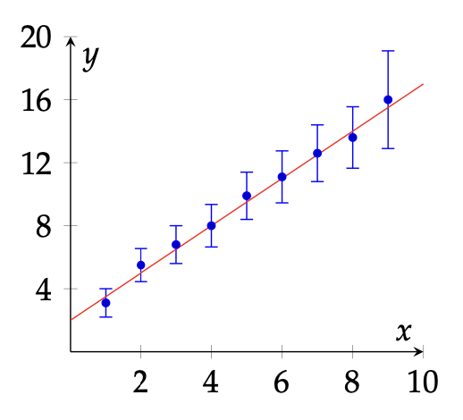

# 14. nodarbība. Numpy lietošana

## 1. uzdevums. Attēlu pārveidošana

> [!NOTE]
> Šajā uzdevumā nepieciešams izmantot divas bibliotēkas: `numpy as np` un `matplotlib.pyplot as plt`, kā arī nepieciešams ielādēt attēlu masīvā `img`.

**Uzdevums**:

1. Izmantojiet `img = plt.imread('brz.jpg')`, lai ielādētu pelēktoņu attēlu `brz.jpg` kā masīvu. Šajā masīvā balto pikseļu vērtība būs 255, bet melno – 0. Parādiet ielādēto attēlu. Noklusējuma krāsu shēma var izskatīties dīvaina, tāpēc izmantojiet `plt.imshow(img, cmap='grey')`.
2. Reiziniet attēla matricu ar 0.25 un parādiet rezultātu. Lai novērstu krāsu mēroga izmaiņas, izmantojiet `plt.imshow(img, cmap='grey', vmax=255)`. Kas notiek, ja attēla matrica tiek reizināta ar skaitli $k > 1$ un $k < 1$?
3. Transponējiet (_transpose_) sākotnējo attēlu un parādiet rezultātu. Kas notika ar attēlu?
4. Sākotnējā attēla izmērs ir $w \times h$: faktiskie izmēri ir ierakstīti `img.shape` mainīgajā. Izveidojiet $w \times w$ diagonālo matricu $C_1$, kas satur `float` tipa skaitļus robežās no 0 līdz 1 uz diagonāles (skaitļu soļa lielumam jābūt vienādam), piemēram:

   $$
   C_1 = \begin{bmatrix}
   0 & 0 & 0 & \cdots & 0 \\
   0 & 0.02 & 0 & \cdots & 0 \\
   0 & 0 & 0.04 & \cdots & 0 \\
   \vdots & \vdots & \vdots & \ddots & \vdots \\
   0 & 0 & 0 & \cdots & 1
   \end{bmatrix}
   $$

   Var izmantot funkcijas `np.linspace(...)` un `np.diag(...)`. Reiziniet sākotnējo attēlu ar $C_1$ no labās puses un parādiet rezultātu. Kā attēlu izmainīja šī darbība?

5. Analogi iepriekšējam punktam, izveidojiet $h \times h$ diagonālo matricu $C_2$ ar elementiem no 0 līdz 1. Reiziniet sākotnējo attēlu ar $C_2$ no kreisās puses un parādiet rezultātu. Komentārs par attēla reizināšanas efektu ar diagonālo matricu no kreisās puses. Kā attēlu izmainīja šī darbība?


---

## 2. uzdevums. Datu aproksimācija

Eksperimentāli iegūtos datus parasti iespējams aproksimēt, izmantojot vispārēju formu (lineāru, eksponenciālu, harmonisku utt.), kuru var teorētiski paredzēt. Tomēr mērījumu varbūtības dēļ gandrīz nekad nevarat uzzīmēt paredzamās formas līniju tā, lai tā ietu cauri visiem faktiskajiem datu punktiem vienlaikus.

Pieņemsim, ka mums ir vektoriālu datu kopa, kas sastāv no neatkarīgajiem lielumiem  
$\vec{x} = (x_1, x_2, \dots , x_N)$ un atkarīgajiem lielumiem  
$\vec{y} = (y_1, y_2, \dots , y_N)$, kur $N$ ir datu punktu skaits kopā.  
Parasti nepieciešams atrast tādu novērtējuma (_estimator_) $\hat{y}(x;\vec{a})$ parametru  
$\vec{a} = (a_1, a_2, \dots , a_M)$ kopu, kas spēj precīzi novērtēt datu kopu (iespēju robežās).

Lai analizētu, cik precīzi novērtētājums $\hat{y}(x;\vec{a})$ apraksta datus, var izmantot zaudējuma funkciju (_loss function_):

$$
L = L(\vec{x}, \vec{y}; \vec{a})
$$

Mērķis ir samazināt šo funkciju, rūpīgi izvēloties parametrus $\vec{a}$.

Šajā uzdevumā tiks izmantots lineārais novērtējums:

$$
\hat{y}(x; a_0, a_1) = a_0 + a_1 x,
$$

kuram nepieciešams atrast parametrus $a_0$ un $a_1$ tā, lai novērtējums aproksimētu datus maksimāli precīzi.

Izvēlēsimies zaudējuma funkciju kā visu starpību kvadrātu summu, svērtu ar kļūdu $\sigma_i$:

$$
L(\vec{x}, \vec{y}; \vec{a}) =
\sum_{i=1}^{N} \frac{[y_i - \hat{y}(x_i; \vec{a})]^2}{\sigma_i^2},
$$

kur $\sigma_i$ ir nenoteiktības no datu faila trešās kolonnas.  
Precīzāki datu punkti vairāk ietekmē novērtējumu, bet punkti ar lielu nenoteiktību – mazāk.

1. attēlā redzami ģenerēti dati ar nenoteiktībām $\sigma_i$, kas aproksimēti ar lineāru novērtējumu.

  
_1. attēls. Ģenerēti dati, kas aproksimēti ar lineāru novērtējumu $\hat{y} = a_0 + a_1 x$, kur $a_0 = 2.00$ un $a_1 = 1.50$._

**Uzdevuma soļi:**

1. Atrodiet un pierakstiet zaudējuma funkciju $L$.
2. Pierakstiet un vienkāršojiet nosacījumus zaudējuma funkcijas minimumam. Šajā gadījumā nav jānovērtē Hesenes (_Hessian_) vērtība.
3. Atrisiniet iegūto sistēmu parametriem $a$, pieņemot, ka $x$, $y$ un $\sigma$ ir zināmi.
4. Ielasiet datus no `data.csv`, izmantojot `csv.reader(...)`. Sakārtojiet tos masīvos `xs`, `ys`, `sigmas`.
   [data.csv](https://estudijas.lu.lv/draftfile.php/1176695/user/draft/264973688/data.csv?time=1729417942990)
5. Izmantojot 3. punktā iegūto, aprēķiniet $a_0$ un $a_1$ ar `numpy`.
6. Attēlojiet datus līdzīgi kā 1. attēlā ar `plt.errorbar(...)`. Saglabājiet rezultātu PDF datnē ar nosaukumu `uzvards.pdf`.

---

## 3. uzdevums. Grafiku pārveidošana

Līnijas plaknē var definēt dažādos veidos. Tiešā veidā uzdotas funkcijas $y = f(x)$, kur punkta ordinātu $y$ nosaka tās abscisa $x$.  
Piemēram, $y = x^2$ definē parabolu.

Netiešā veidā: punktiem $(x, y)$, kas pieder līnijai, jāatbilst vienādojumam $F(x, y) = 0$.
Piemēram, $x^2 + y^2 - 1 = 0$ definē riņķa līniju.

Polārā forma $\rho(\phi)$ apraksta rādiusu $\rho$ atkarībā no leņķa $\phi$.  
Piemēram, $\rho = \phi$ ir Arhimēda spirāle.

Parametriskā forma nosaka gan $x$, gan $y$ kā parametra $t$ funkcijas.  
Dota līnija parametriskajā formā:

$$
\begin{cases}
x(t) = (a - b) \cos t + h \cos\!\left(\tfrac{a - b}{r} t\right) \\
y(t) = (a - b) \sin t - h \sin\!\left(\tfrac{a - b}{r} t\right)
\end{cases}
$$

kur $a = 3$, $b = 1$, $h = -\tfrac{3}{2}$, $r = 1$, $t \in [0, 2\pi]$.

---

**Uzdevuma izpildes soļi:**

1. Definējiet funkciju `xy(t)`, kas kā argumentu saņem 1D `np.array` un atgriež divu 1D `np.array` pāri (`tuple`): vienu ar $x$ vērtībām un otru ar $y$ vērtībām.  
   Lai atgrieztu virkni, vienkārši atdaliet divus tā elementus ar komatu `return` operatorā:  

   ```python
   return x, y
   ```

2. Grafiku asis un izmēri parasti tiek izvēlētas automātiski, tomēr šoreiz tos nepieciešams iestatīt manuāli, izmantojot:

   ```python
   plt.xlim(...)
   plt.ylim(...)
   plt.figure(figsize=...)
   plt.grid(...)
   ```

3. Definējiet `np.array` masīvu `t` ar vienādiem soļiem, kas satur vismaz 100 elementus (varat izmantot funkciju `np.linspace(...)`).  
   Pēc tam izmantojiet iepriekš definēto funkciju `xy(t)`, lai izveidotu `np.array` ar $x$ un $y$ vērtībām.  
   Iestatiet grafikam ierobežojumus: $x \in [−4, 4]$ un $y \in [−4, 4]$, malu attiecību 1, ieslēdziet režģa līnijas un uzzīmējiet grafiku $\{x(t), y(t)\}$.

4. Definējiet funkciju `rotate(phi)`, kas kā argumentu saņem leņķi $\phi$ un atgriež atbilstošu rotācijas matricu $\mathbf{R}_{\phi}$.  
   Izmantojiet šo funkciju, lai izveidotu matricu, kas pārveidotu koordinātas tā, lai viena no grafika cilpām būtu vertikāli izlīdzināta.

5. Veiciet faktisko $x$ un $y$ masīvu pagriešanu, izmantojot matricu no iepriekšējā uzdevuma, un uzzīmējiet rezultātu.  
   Viens no veidiem, kā to izdarīt:
   - apvienot $x$ un $y$ masīvus vienā matricā, izmantojot `np.vstack(...)`,  
   - veikt masīvu pagriešanu ar apvienoto matricu,  
   - sadalīt rezultātu atpakaļ $x$ un $y$ masīvos ar  

     ```python
     x, y = resulting_matrix_with_two_rows
     ```

6. Definējiet funkciju `scale(kx=1, ky=1)`, kas kā argumentus saņem divus mērogošanas koeficientus $k_x$ un $k_y$ un atgriež atbilstošo mērogošanas matricu $\mathbf{S}$.  
   Izmantojiet šo funkciju, lai izveidotu matricu, kas mērogotu grafiku līdz aptuveni Eifeļa torņa formai.  
   Izmēģiniet $k_x = \frac{3}{4}$ un $k_y = \frac{4}{3}$.

7. Veiciet (jau pagriezto) $x$ un $y$ masīvu faktisko mērogošanu, izmantojot matricu no iepriekšējā uzdevuma, un uzzīmējiet rezultātu.

8. Lai “Eifeļa tornis” neatrastos attēla vidū, izmantojiet bīdes transformāciju, lai pārvietotu iegūto diagrammu par 1,5 vienībām pa labi un 1 vienību uz leju, un uzzīmējiet rezultātu.

9. Spēcīgs vējš pūš no kreisās puses, un torņa gabals kļūst šķībs.  
   Definējiet funkciju `shear(sx=0, sy=0)`, kas kā argumentus saņem divus bīdes koeficientus $s_x$ un $s_y$ un atgriež atbilstošo bīdes matricu $\mathbf{H}$.  
   Izmantojiet šo funkciju, lai izveidotu matricu, kas pārveidotu grafiku tā, lai torņa gala abscisa pārceltos uz aptuveni 2,5.

10. Veiciet faktisko $x$ un $y$ masīvu nobīdi, izmantojot iepriekšējā uzdevuma matricu, un uzzīmējiet rezultātu.

## Papildus uzdevumi

**Papildus uzdevumi prasmju nostiprināšanai.
_Izpilde nav obligāta, bet ir vēlama!_**

1. Izveidot viendimensionālu `numpy` masīvu `kapinataji` ar 30 vienmērīgi sadalītiem skaitļiem (-20, -18.6207, -17.2414, ... , 20). Iegūt jaunu masīvu `pakapes`, kas satur $2^n$, kur $n$ ir masīva `kapinataji` elementi.
2. Izveidot 2D masīvu (matricu) ar izmēriem 20 rindas un 15 kolonnas, kas satur tikai pieciniekus. Aizstāt tā pēdējo rindu ar skaitļiem 0, 2, 4, ... , 28.
3. Izmantojot `np.mean()` funkciju, izveidot divus jaunus masīvus, kuri satur nupat veidotā piecinieku masīva vidējās vērtības pa rindām un pa kolonnām.
4. Pārveidot iepriekš veidoto piecinieku matricu tā, lai tas saturētu tos pašus elementus, bet 5 rindas un 60 kollonas. Izdzēst jauniegūtās matricas pirmo rindu, pievienot rindu ar divniekiem kā pēdējo un noteikt beigu matricas izmēru, dimensiju, kā arī elementu skaitu.

**Paaugstinātas grūtības papildus uzdevumi.**

1. Noskaidrot, cik no 1. uzdevuma `pakapes` masīva elementiem ir lielāki par $13.37$ (izmantojot `numpy` iespējas).
2. Definēt $100 \times 100$ elementu lielu `numpy` masīvu ar gadījuma rakstura skaitļiem, kas pakļaujas normālajam sadalījumam. Patvaļīgi izvēlēties normālā sadalījuma vidējo vērtību un standartnovirzi. Aprēķināt izveidotā masīva faktisko vidējo vērtību un standartnovirzi, izmantojot `numpy` iespējas. Aprēķināt atšķirības starp faktisko skaitļu masīva vidējo vērtību un sākotnēji pieprasīto vērtību.
